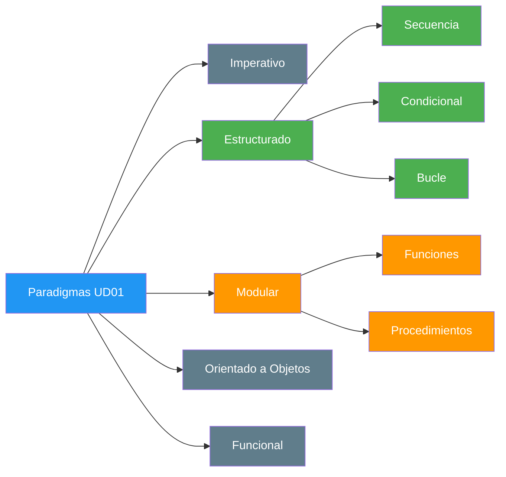
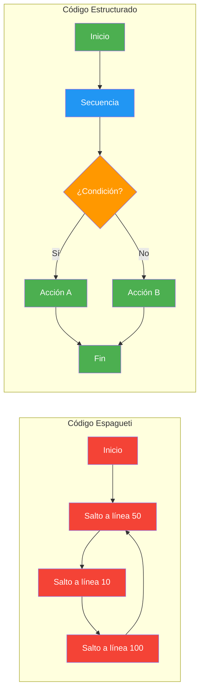
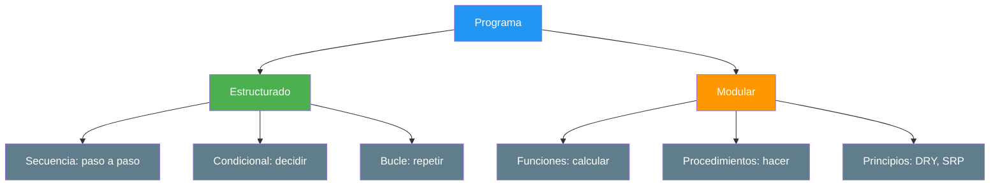
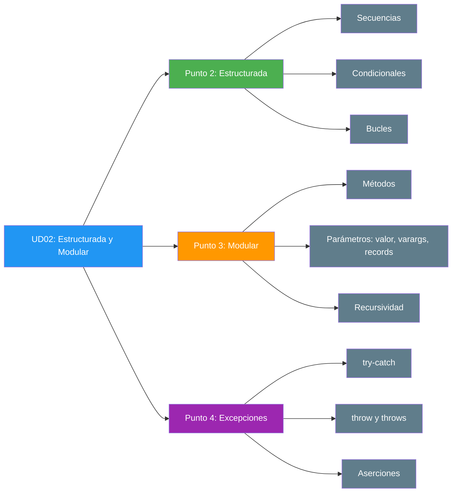

- [1. Introducción](#1-introducción)
  - [1.1. Programación estructurada y modular: un paradigma](#11-programación-estructurada-y-modular-un-paradigma)
  - [1.2. Del caos al orden: una analogía](#12-del-caos-al-orden-una-analogía)
  - [1.3. Conexión con UD01: lo que ya sabes](#13-conexión-con-ud01-lo-que-ya-sabes)
  - [1.4. ¿Qué aprenderás en esta unidad?](#14-qué-aprenderás-en-esta-unidad)


# 1. Introducción

> 💡 **Punto de partida:** ¿Alguna vez has intentado seguir una receta de cocina que no tenía pasos numerados? ¿O montar un mueble de IKEA sin instrucciones? Eso es programar sin estructura: el código funciona (a veces), pero nadie lo entiende ni lo puede mantener.

**Objetivos de aprendizaje:**

- Comprender qué es la programación estructurada y modular y por qué es importante
- Diferenciar entre programación estructurada y modular
- Conocer las tres estructuras de control básicas (secuencia, condicional, bucle)
- Entender la conexión con los conceptos de la UD01

En la UD01 vimos qué es la programación, los algoritmos y los paradigmas. Aprendimos a escribir programas simples: declarar variables, leer datos y mostrar resultados. Pero ¿qué pasa cuando el problema crece? ¿Cómo organiza Netflix el algoritmo que decide qué serie recomendarte? ¿Cómo gestiona Instagram el filtro que aplica a tu foto?

La respuesta es: **programación estructurada y modular**.

## 1.1. Programación estructurada y modular: un paradigma

Recordarás de la UD01 que un **paradigma** es un estilo o filosofía de programación. La programación estructurada y modular es un **paradigma** que se basa en dos ideas fundamentales:

- **Estructurada**: el código se escribe usando solo tres estructuras de control (secuencia, condicional, bucle). Sin saltos desordenados.
- **Modular**: el código se divide en piezas pequeñas y reutilizables (métodos: funciones y procedimientos). Sin todo en un solo sitio.



📌 **Ejemplo real:** Netflix usa programación estructurada para el flujo de reproducción: secuencia (cargar vídeo → reproducir → pausar), condicionales (¿está suscrito? ¿hay conexión?) y bucles (¿seguir reproduciendo la siguiente serie?). Cada paso es claro, predecible y mantenible.

Antes de este paradigma, el código fluía de forma desordenada mediante saltos incondicionales (`GOTO`), lo que se conocía como **código espagueti**: una maraña de saltos imposible de mantener.

> 📝 **Curiosidad:** En Java, `goto` es una **palabra reservada** pero no se puede usar. Los creadores del lenguaje la reservaron precisamente para que nadie pudiera escribir código espagueti con ella.



## 1.2. Del caos al orden: una analogía

Un programa bien estructurado es como una **empresa bien organizada**:

| Empresa | Programa |
|---------|----------|
| Cada departamento tiene una función clara | Cada módulo/responsabilidad está separada |
| Existen protocolos para tomar decisiones | Condicionales (`if`, `switch`) |
| Se repiten procesos cada mes | Bucles (`while`, `for`) |
| Un empleado no hace todo solo | Modularidad: funciones y procedimientos |



## 1.3. Conexión con UD01: lo que ya sabes

En la UD01 aprendiste las bases que ahora usaremos como cimientos:

| UD01 (Lo que sabes) | UD02 (Lo que aprenderás) |
|---------------------|--------------------------|
| Tipos de datos (`int`, `String`, `boolean`) | Cómo pasarlos a métodos (en Java, siempre por valor) |
| Variables y constantes (`final`) | Ámbito: dónde vive cada variable |
| Entrada por consola (`Scanner`) | `hasNextInt()` para leer números de forma segura |
| Salida por consola (`System.out.println()`) | Formateo con `printf` y `String.format` |
| Operadores aritméticos y lógicos | Condicionales complejos (`if-else`, `switch`) |
| Conversión de tipos | Casting explícito y `Integer.parseInt` |
| Paradigmas de programación | Profundizar en estructurado y modular |

📌 **Ejemplo real:** Instagram lee tu nombre (`String`), tu edad (`int`) y tu email (`String`). En la UD01 solo sabías mostrarlos. En la UD02 aprenderás a pasarlos a métodos que validen, calculen y tomen decisiones con esos datos.

> 📝 **Nota sobre los ejemplos de esta unidad:** En Java todo el código vive dentro de una clase. Para que los ejemplos sean cortos:
> - Los fragmentos de código se suponen **dentro del método `main`**.
> - Los métodos que definimos (funciones y procedimientos) son **`static`** y están **dentro de la misma clase**.
> - Cuando se lee de teclado, se supone creado un `Scanner sc = new Scanner(System.in);` (con `import java.util.Scanner;`).
> - Usamos **Java 21 LTS o superior**. Lo que necesita una versión más moderna se indica junto al ejemplo.

```java
import java.util.Scanner;

public class Main {

    public static void main(String[] args) {
        Scanner sc = new Scanner(System.in);
        // Aquí van los fragmentos de código de los ejemplos
    }

    // Aquí van los métodos static (funciones y procedimientos)
}
```

## 1.4. ¿Qué aprenderás en esta unidad?



Al finalizar esta unidad serás capaz de:

- **Escribir código claro** usando secuencias, condicionales y bucles
- **Tomar decisiones** con `if-else`, `switch` y el operador ternario
- **Repetir tareas** con `while`, `for`, `do-while` y for-each
- **Dividir problemas** en métodos (funciones y procedimientos) reutilizables
- **Pasar y devolver datos** entendiendo el paso por valor, los varargs (`...`) y los records
- **Manejar errores** con `try-catch-finally`, `throw` y `throws`
- **Depurar código** con el depurador del IDE y aserciones (`assert`)

> 💡 **Consejo:** Esta unidad es la base de todo lo que viene. Si dominas estructurada y modular, la POO (UD04) será mucho más fácil. Piensa en ella como aprender a cocinar antes de abrir un restaurante.

En el siguiente punto veremos la programación estructurada en profundidad: secuencias, condicionales (`if-else`, `switch`, ternario), bucles (`while`, `for`, `do-while`) y cómo trabajar de forma segura con valores `null`.

## Buenas prácticas

- [ ] Usar siempre las tres estructuras de control básicas: secuencia, condicional y bucle
- [ ] Evitar los saltos desordenados — en Java ni siquiera existe un `goto` utilizable
- [ ] Aplicar el principio DRY (Don't Repeat Yourself) desde el primer día
- [ ] Organizar el código en módulos con una responsabilidad clara (SRP)
- [ ] Conectar los conceptos nuevos con los conocimientos previos de la UD01
