- [2. Programación estructurada](#2-programación-estructurada)
  - [2.1. El teorema de la programación estructurada](#21-el-teorema-de-la-programación-estructurada)
  - [2.2. Secuencias](#22-secuencias)
  - [2.3. Condicionales](#23-condicionales)
    - [A. Condicional simple (`if`)](#a-condicional-simple-if)
    - [B. Condicional compuesto (`if-else`)](#b-condicional-compuesto-if-else)
    - [C. Condicionales múltiples (`if-else if-else`)](#c-condicionales-múltiples-if-else-if-else)
    - [D. Estructura `switch`](#d-estructura-switch)
    - [E. Expresión `switch` moderna (Java 14+)](#e-expresión-switch-moderna-java-14)
    - [F. Control de nulos con condicionales](#f-control-de-nulos-con-condicionales)
    - [G. Operador ternario `? :`](#g-operador-ternario--)
    - [H. Valores por defecto ante `null`](#h-valores-por-defecto-ante-null)
  - [2.4. Bucles](#24-bucles)
    - [A. Bucle `while`](#a-bucle-while)
    - [B. Bucle `do-while`](#b-bucle-do-while)
    - [C. Bucle `for`](#c-bucle-for)
    - [D. Bucle for-each (`for` mejorado)](#d-bucle-for-each-for-mejorado)
    - [E. Comparativa de bucles](#e-comparativa-de-bucles)
  - [2.5. Mecanismos de control de bucles](#25-mecanismos-de-control-de-bucles)
    - [A. Bucles controlados por indicadores (banderas o flags)](#a-bucles-controlados-por-indicadores-banderas-o-flags)
    - [B. Bucles controlados por centinela](#b-bucles-controlados-por-centinela)
    - [C. Bucles anidados](#c-bucles-anidados)
  - [2.6. Sentencias de salto](#26-sentencias-de-salto)
    - [A. `break`](#a-break)
    - [B. `continue`](#b-continue)
  - [2.7. Peligros: el bucle infinito](#27-peligros-el-bucle-infinito)
  - [2.8. Depuración: aserciones y técnicas](#28-depuración-aserciones-y-técnicas)


# 2. Programación estructurada

> 💡 **Punto de partida:** ¿Has jugado a un videojuego con decisiones? En The Witcher, cada elección que tomas (¿ayudar al aldeano o al mercader?) abre un camino diferente. Los condicionales son eso: tu programa elige qué camino seguir. Y los bucles son como las misiones repetitivas: "mata 10 lobos" = repite 10 veces la misma acción.

**Objetivos de aprendizaje:**

- Entender el Teorema de la Programación Estructurada y las tres estructuras de control
- Usar condicionales (`if-else`, `switch`, ternario) para tomar decisiones
- Implementar bucles (`while`, `for`, `do-while`, for-each) para repetir tareas
- Controlar el flujo de bucles con `break` y `continue`
- Depurar código con aserciones y técnicas del IDE

La **programación estructurada** es un paradigma que busca crear programas más claros y fáciles de mantener. Se basa en el **Teorema de la Programación Estructurada**, que demuestra que cualquier algoritmo puede implementarse con solo **tres estructuras de control** básicas:

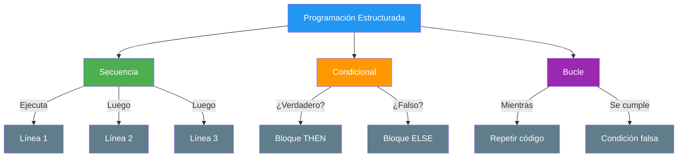

**Principio DRY (Don't Repeat Yourself)**:
Si ves que estás copiando y pegando el mismo bloque de código varias veces, es una señal de que necesitas una **estructura de control** (bucle) o un **módulo** (método). ¡Aplica DRY desde el primer día!

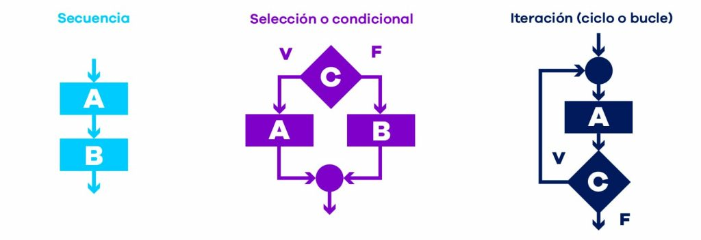

📌 **Ejemplo real:** Spotify usa secuencias para cargar tu playlist, condicionales para decidir si eres premium o free, y bucles para reproducir cada canción una tras otra. Sin estas estructuras, el código sería un caos imposible de mantener.

## 2.1. El teorema de la programación estructurada

El teorema establece que cualquier programa "propio" (con un único punto de entrada y salida, sin bucles infinitos) puede escribirse usando **únicamente** estas tres estructuras. Esto significa que:

- **No necesitas `goto`** → las tres estructuras son suficientes (y en Java ni siquiera existe)
- **El código es predecible** → siempre sabes qué línea se ejecuta después
- **Es fácil de depurar** → puedes seguir el flujo paso a paso

```java
// Ejemplo: las tres estructuras juntas
System.out.print("Introduce tu edad: ");
int edad = sc.nextInt(); // Secuencia

if (edad >= 18) { // Condicional
    System.out.println("Eres mayor de edad.");
} else {
    System.out.println("Eres menor de edad.");
}

for (int i = 1; i <= 3; i++) { // Bucle
    System.out.println("Intento " + i);
}
```

> 💡 **Consejo:** Piensa en el teorema como las piezas de Lego: con solo tres tipos de pieza puedes construir cualquier cosa. La clave está en cómo las combinas.

## 2.2. Secuencias

Es la estructura más simple. El programa ejecuta las instrucciones **de arriba hacia abajo**, una por una.

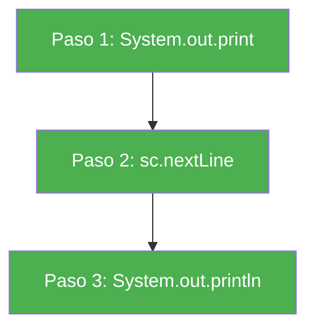

```java
// Ejemplo de Secuencia
System.out.print("¿Cómo te llamas? ");
String nombre = sc.nextLine();

System.out.print("¿Cuántos años tienes? ");
int edad = sc.nextInt();

System.out.println("Hola " + nombre + ", tienes " + edad + " años.");
// Se ejecuta línea a línea, sin saltos ni repeticiones
```

> ⚠️ **Cuidado con el `Scanner`:** `nextInt()` lee el número pero deja el salto de línea (Intro) en el búfer. Si después llamas a `nextLine()`, leerá una cadena vacía. Solución: llama a `sc.nextLine()` una vez más para "limpiar" el búfer, o lee siempre con `nextLine()` y convierte con `Integer.parseInt(...)`.

📌 **Ejemplo real:** Cuando abres Netflix, primero carga tu perfil (línea 1), luego muestra el catálogo (línea 2), después reproduce el vídeo seleccionado (línea 3). Es una secuencia perfecta.

## 2.3. Condicionales

Los condicionales permiten que nuestro programa **tome decisiones** y se comporte de manera diferente según las circunstancias.

### A. Condicional simple (`if`)

Evalúa una condición booleana. Si es `true`, ejecuta el bloque de código.

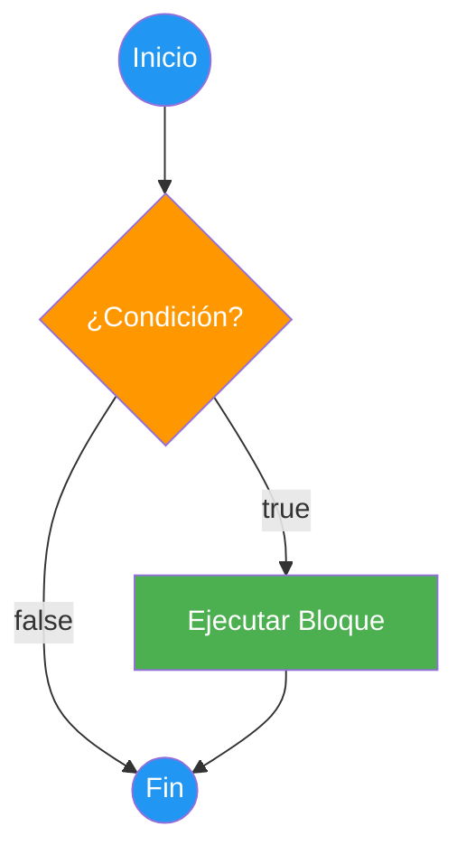

```java
System.out.print("Introduce tu edad: ");
int edad = sc.nextInt();

if (edad >= 18) {
    System.out.println("Eres mayor de edad. Puedes votar.");
}
// Si edad < 18, simplemente no hace nada y continúa
```

📌 **Ejemplo real:** YouTube usa `if` para comprobar si tienes Premium: si es `true`, reproduce sin anuncios; si es `false`, muestra un anuncio primero.

### B. Condicional compuesto (`if-else`)

Ejecuta un bloque si se cumple la condición y **otro bloque** si no se cumple.

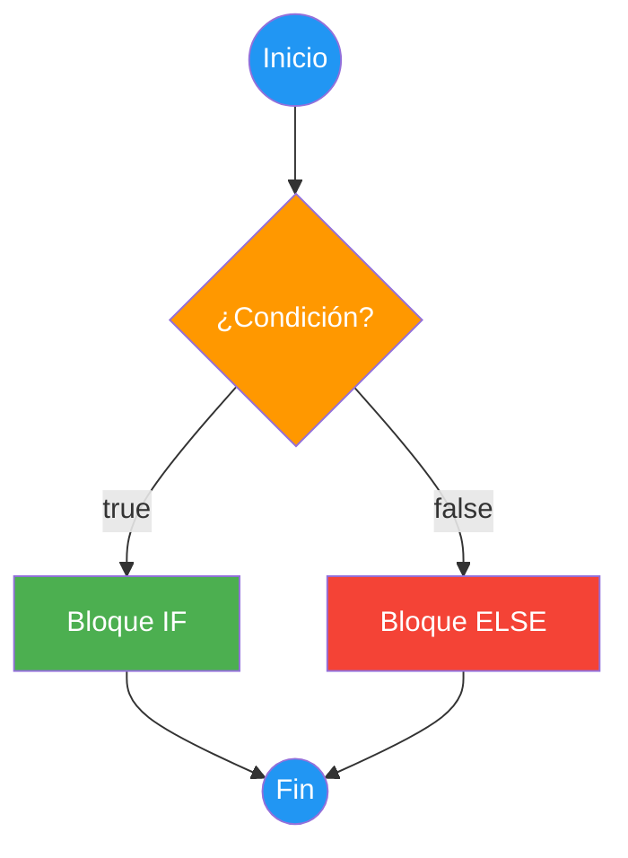

```java
System.out.print("Introduce tu edad: ");
int edad = sc.nextInt();

if (edad >= 18) {
    System.out.println("Eres mayor de edad.");
} else {
    System.out.println("Eres menor de edad.");
}
```

📌 **Ejemplo real:** Spotify decide si reproduces en calidad alta o normal: si eres premium → calidad alta; si no → calidad normal. Nunca ambas a la vez.

### C. Condicionales múltiples (`if-else if-else`)

Permite encadenar varias condiciones. Evalúa en orden y ejecuta la **primera que sea verdadera**.

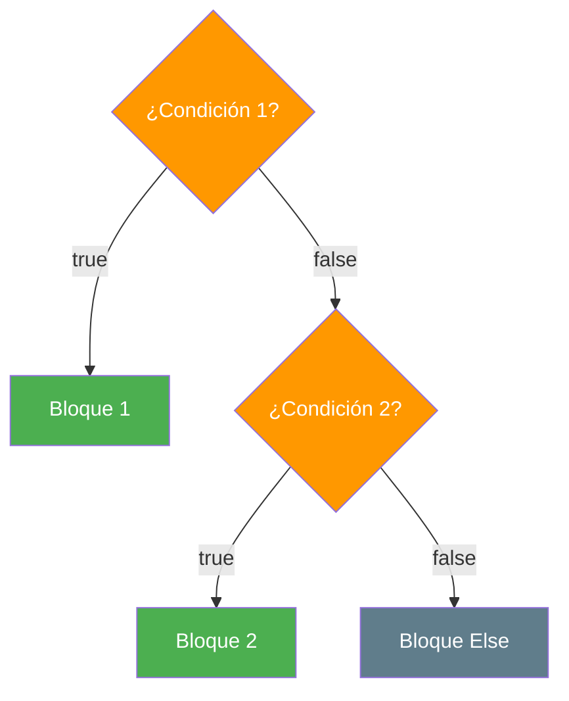

```java
System.out.print("Introduce tu nota (0-10): ");
double nota = sc.nextDouble();

if (nota >= 9) {
    System.out.println("Sobresaliente");
} else if (nota >= 7) {
    System.out.println("Notable");
} else if (nota >= 5) {
    System.out.println("Aprobado");
} else {
    System.out.println("Suspenso");
}
```

> 📝 **Nota:** `Scanner` usa la configuración regional del sistema. En un equipo en español, `nextDouble()` espera **coma decimal** (`7,5`). Si quieres usar punto (`7.5`), crea el Scanner así: `new Scanner(System.in).useLocale(Locale.US)` (con `import java.util.Locale;`).

> ⚠️ **Advertencia:** El orden importa. Si ponemos `if (nota >= 5)` antes que `if (nota >= 9)`, nunca llegaremos al sobresaliente porque el 9 cumple también `>= 5`. Evalúa siempre de mayor a menor.

📌 **Ejemplo real:** Amazon clasifica tus compras: si el gasto > 1000€ → cliente VIP; si > 500€ → cliente preferente; si > 100€ → cliente normal; si no → cliente nuevo.

### D. Estructura `switch`

Cuando necesitamos comparar **una única variable** contra múltiples valores, `switch` es más limpio que una cadena de `if-else if`.

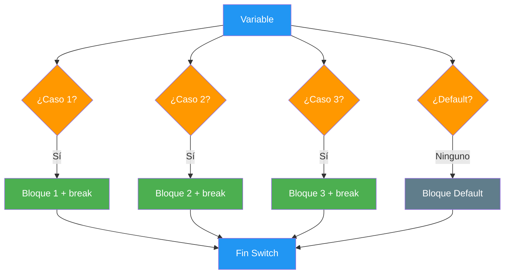

```java
System.out.print("Introduce el día de la semana (1-7): ");
int dia = sc.nextInt();

String nombreDelDia;

switch (dia) {
    case 1:
        nombreDelDia = "Lunes";
        break;
    case 2:
        nombreDelDia = "Martes";
        break;
    case 3:
        nombreDelDia = "Miércoles";
        break;
    case 4:
        nombreDelDia = "Jueves";
        break;
    case 5:
        nombreDelDia = "Viernes";
        break;
    case 6:
    case 7:
        nombreDelDia = "Fin de semana";
        break;
    default:
        nombreDelDia = "Día inválido";
        break;
}

System.out.println("Hoy es: " + nombreDelDia);
```

> ⚠️ **Advertencia — el *fall-through*:** En el `switch` clásico de Java, si olvidas el `break` **el compilador no da error**: la ejecución "cae" al siguiente `case` y lo ejecuta también. Es un error lógico silencioso y muy habitual:
>
> ```java
> int dia = 1;
> switch (dia) {
>     case 1:
>         System.out.println("Lunes");   // Sin break...
>     case 2:
>         System.out.println("Martes");  // ...¡también se ejecuta!
>         break;
> }
> // Salida: Lunes
> //         Martes
> ```
>
> Esa "caída" es justo lo que aprovechamos a propósito en `case 6: case 7:` para agrupar casos. Para evitar sustos, usa la sintaxis moderna con flecha (`->`) que verás a continuación.

### E. Expresión `switch` moderna (Java 14+)

Java permite escribir `switch` con flechas (`->`) y usarlo como una **expresión** que devuelve un valor. Es más conciso y **no tiene fall-through**: no hace falta `break`.

```java
System.out.print("Introduce el día de la semana (1-7): ");
int dia = sc.nextInt();

String nombreDelDia = switch (dia) {
    case 1 -> "Lunes";
    case 2 -> "Martes";
    case 3 -> "Miércoles";
    case 4 -> "Jueves";
    case 5 -> "Viernes";
    case 6, 7 -> "Fin de semana";   // Varios valores separados por comas
    default -> "Día inválido";      // default: si no coincide ningún caso
};

System.out.println("Hoy es: " + nombreDelDia);
```

> 💡 **Consejo:** También puedes hacer `switch` sobre `String` y sobre `enum`. Con `String`, la comparación se hace con `equals()` internamente, así que es segura.

### F. Control de nulos con condicionales

Trabajar con `null` es inevitable en Java: cualquier variable de tipo objeto (`String`, arrays, objetos...) puede valer `null`. Si llamas a un método sobre `null`, el programa lanza un `NullPointerException`. Hay varias formas de comprobarlo:

**`!= null` y `== null` — La forma clásica y habitual:**

```java
String nombre = null;

if (nombre != null) {
    System.out.println(nombre.length());
} else {
    System.out.println("Nombre no proporcionado");
}
```

**`Objects.isNull()` y `Objects.nonNull()` — La misma comprobación como método:**

```java
import java.util.Objects;

String nombre = null;

if (Objects.nonNull(nombre)) {
    System.out.println(nombre.length());
} else {
    System.out.println("Nombre no proporcionado");
}
```

> 💡 **Consejo:** En código normal, `!= null` es lo más legible. `Objects.nonNull` resulta útil más adelante con streams y lambdas (UD06), donde se necesita la comprobación "en forma de método".

**`instanceof` con patrón — Comprobar tipo + no nulo + extraer (Java 16+):**

Cuando tienes un dato de tipo general (`Object`) y necesitas usarlo como un tipo concreto, `instanceof` con patrón comprueba el tipo **y** lo extrae en una nueva variable ya convertida. Además, `instanceof` devuelve `false` si el dato es `null`, así que también te protege de los nulos:

```java
Object dato = obtenerDato();

// Comprueba que es String (y no es null) Y lo extrae en "texto"
if (dato instanceof String texto) {
    System.out.println("Es un String: " + texto.toUpperCase());
}

// Comprueba que es un número entero
if (dato instanceof Integer numero) {
    System.out.println("Es un entero: " + (numero * 2));
}
```

**Resumen de comprobación de nulos:**

| Expresión | ¿Qué hace? | Cuándo usarla |
|-----------|------------|---------------|
| `x != null` | Comprueba que no es null | Forma habitual, siempre funciona |
| `x == null` | Comprueba que es null | Forma habitual |
| `Objects.nonNull(x)` / `Objects.isNull(x)` | Igual, pero como método | Con lambdas y streams (UD06) |
| `x instanceof String s` | Comprueba no-null + tipo + extrae en `s` | Cuando necesitas un cast seguro |
| `Objects.requireNonNullElse(x, valor)` | Si es null, usa un valor por defecto | Asignaciones rápidas |
| `Objects.requireNonNull(x, "mensaje")` | Si es null, lanza `NullPointerException` | Validar parámetros (punto 4) |

📌 **Ejemplo real:** Netflix comprueba con `suscripcion != null` si un usuario tiene suscripción antes de mostrar contenido premium. Si la suscripción es `null`, muestra un mensaje de "suscríbete" en vez de intentar acceder a datos inexistentes.

Una de las técnicas más útiles para evitar errores en los condicionales es el uso de **paréntesis** para agrupar condiciones complejas:

```java
int edad = 20;
boolean tieneDNI = true;

if ((edad >= 18) && (tieneDNI)) {
    System.out.println("Puedes votar.");
} else {
    System.out.println("No puedes votar.");
}
```

> 💡 **Truco:** `&&` y `||` son de **cortocircuito**: si la primera parte ya decide el resultado, la segunda no se evalúa. Por eso `if (nombre != null && nombre.length() > 3)` es seguro: si `nombre` es `null`, nunca se llega a llamar a `length()`.

### G. Operador ternario `? :`

Como viste en la UD01, el operador ternario es una forma **reducida** del `if-else` que devuelve un valor. Es útil para asignaciones simples:

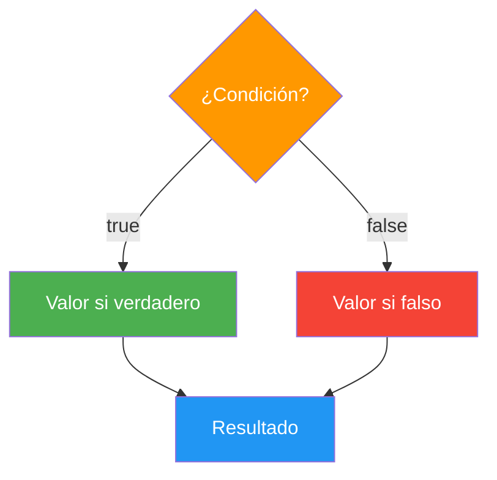

```java
int edad = 20;

// Con if-else (verboso)
String mensaje;
if (edad >= 18) {
    mensaje = "Mayor de edad";
} else {
    mensaje = "Menor de edad";
}

// Con ternario (conciso)
String mensaje2 = edad >= 18 ? "Mayor de edad" : "Menor de edad";

System.out.println(mensaje2); // Mayor de edad
```

> 💡 **Consejo:** Usa el ternario cuando la asignación sea simple (una línea). Si la lógica es compleja (varias condiciones, efectos secundarios), usa `if-else` normal.

### H. Valores por defecto ante `null`

Otros lenguajes (como C# o Kotlin) tienen un operador específico para "si es `null`, usa este otro valor". **Java no lo tiene**, pero hay alternativas:

```java
String nombre = null;

// Con if-else
String nombreSeguro;
if (nombre != null) {
    nombreSeguro = nombre;
} else {
    nombreSeguro = "Desconocido";
}

// Con ternario
String nombreSeguro2 = (nombre != null) ? nombre : "Desconocido";

// Con Objects.requireNonNullElse (Java 9+): el más conciso
String nombreSeguro3 = Objects.requireNonNullElse(nombre, "Desconocido");

System.out.println(nombreSeguro3); // Desconocido
```

Y para asignar un valor **solo si** la variable es `null`, basta un `if`:

```java
String nombre = null;
if (nombre == null) nombre = "Visitante"; // Si es null, asigna "Visitante"
System.out.println(nombre); // Visitante

if (nombre == null) nombre = "Otro";      // Ya no es null, no cambia
System.out.println(nombre); // Sigue siendo Visitante
```

📌 **Ejemplo real:** Netflix muestra "Sin descripción" cuando una serie no tiene sinopsis: `Objects.requireNonNullElse(sinopsis, "Sin descripción")`.

> 💡 **Truco:** Usa `switch` cuando compares una variable contra valores concretos. Usa `if-else if` cuando las condiciones sean expresiones complejas (rangos, operadores lógicos).

## 2.4. Bucles

Los bucles nos permiten **repetir** un bloque de código varias veces, ahorrándonos escribir la misma lógica una y otra vez.

📌 **Ejemplo real:** TikTok usa bucles para cargar tu feed: mientras haya vídeos nuevos, los muestra uno tras otro. Cuando te quedas sin contenido, el bucle para.

### A. Bucle `while`

Evalúa la condición **antes** de cada iteración. Si la condición es `false` al inicio, **nunca se ejecuta**.

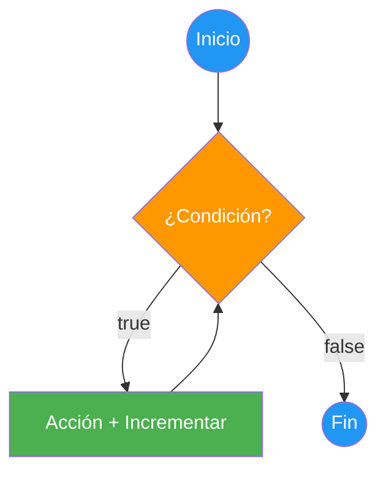

```java
int contador = 0;
while (contador < 5) {
    System.out.println("Contador: " + contador);
    contador++;  // ¡Importante! Sin esto, bucle infinito
}
// Salida: 0, 1, 2, 3, 4
```

### B. Bucle `do-while`

Evalúa la condición **después** de cada iteración. Garantiza **al menos una ejecución**.

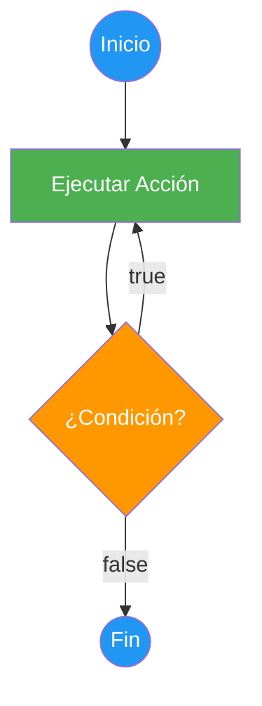

```java
String opcion;

do {
    System.out.println("=== MENÚ ===");
    System.out.println("1. Ver perfil");
    System.out.println("2. Configuración");
    System.out.println("3. Salir");
    System.out.print("Opción: ");
    opcion = sc.nextLine();

    System.out.println("Seleccionaste: " + opcion);
} while (!opcion.equals("3"));

System.out.println("¡Hasta luego!");
```

> ⚠️ **Advertencia:** Los `String` se comparan con `equals()`, **nunca con `==`**. El operador `==` compara si son el mismo objeto en memoria, no si tienen el mismo texto. Lo verás en detalle en el punto 3.

> 💡 **Consejo:** `do-while` es perfecto para menús: siempre quieres mostrar el menú al menos una vez, sin importar qué elija el usuario.

### C. Bucle `for`

Los bucles `for` se usan cuando **sabemos cuántas veces** queremos repetir. Incluye inicialización, condición e incremento en una sola línea.

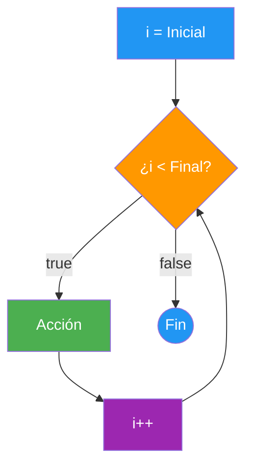

```java
// Ascendente: de 0 a 5
for (int i = 0; i <= 5; i++) {
    System.out.println(i); // 0, 1, 2, 3, 4, 5
}

// Descendente: de 5 a 0
for (int i = 5; i >= 0; i--) {
    System.out.println(i); // 5, 4, 3, 2, 1, 0
}

// De 2 en 2
for (int i = 0; i <= 10; i += 2) {
    System.out.println(i); // 0, 2, 4, 6, 8, 10
}
```

> 💡 **Truco nemotécnico:**
> - **`for`** = **F**ijo → sabes cuántas veces
> - **`while`** = **W**hile → mientras se cumpla, repite
> - **`do-while`** = **D**o → hacer al menos una vez

### D. Bucle for-each (`for` mejorado)

Recorre automáticamente todos los elementos de una colección (array, lista, etc.). No necesitas controlar el índice. Se lee: "**para cada** fruta **en** frutas".

```java
String[] frutas = {"Manzana", "Plátano", "Naranja", "Fresa"};

for (String fruta : frutas) {
    System.out.println("Fruta: " + fruta);
}
// Salida: Manzana, Plátano, Naranja, Fresa
```

> 📝 **Nota:** El for-each es ideal para recorrer arrays cuando no necesitas la posición. Lo verás en detalle en la UD03 cuando estudiemos arrays y matrices.

### E. Comparativa de bucles

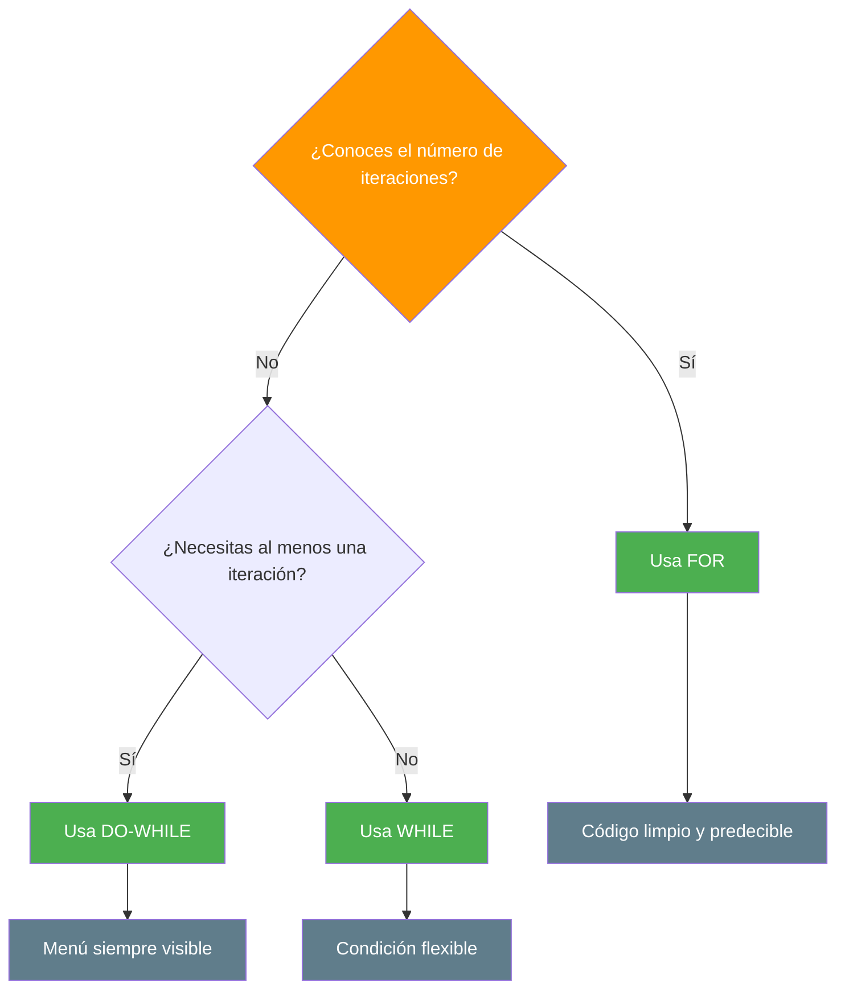

**Comparativa visual con código:**

```java
// WHILE: Evalúa ANTES de ejecutar (puede no ejecutarse nunca)
int i = 0;
while (i < 3) {
    System.out.println("while: " + i);
    i++;
}
// Salida: while: 0, while: 1, while: 2

// DO-WHILE: Evalúa DESPUÉS de ejecutar (siempre se ejecuta al menos una vez)
int j = 0;
do {
    System.out.println("do-while: " + j);
    j++;
} while (j < 3);
// Salida: do-while: 0, do-while: 1, do-while: 2

// FOR: Todo junto (inicialización, condición, incremento)
for (int k = 0; k < 3; k++) {
    System.out.println("for: " + k);
}
// Salida: for: 0, for: 1, for: 2
```

## 2.5. Mecanismos de control de bucles

Existen **tres formas típicas** de controlar cuándo se ejecuta un bucle:

### A. Bucles controlados por indicadores (banderas o flags)

Las **banderas** son variables booleanas (`boolean`) que controlan la ejecución del bucle.

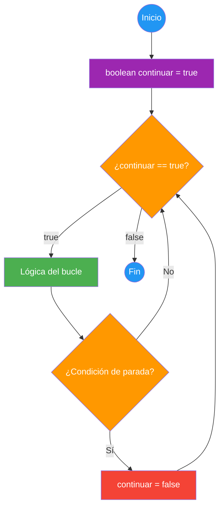

```java
// Ejemplo: Determinar si un número contiene solo cifras menores que 5
boolean menor;
int num;

System.out.print("Introduce un número: ");
num = sc.nextInt();

menor = true; // Inicialización del indicador

while (menor && (num > 0)) {
    if (num % 10 >= 5) {
        menor = false; // Cambiamos la bandera
    }
    num = num / 10; // Eliminamos la última cifra
}

if (menor) {
    System.out.println("Todas las cifras son menores que 5");
} else {
    System.out.println("Hay alguna cifra mayor o igual que 5");
}
```

### B. Bucles controlados por centinela

Un **centinela** es un valor especial que indica la parada de la iteración.

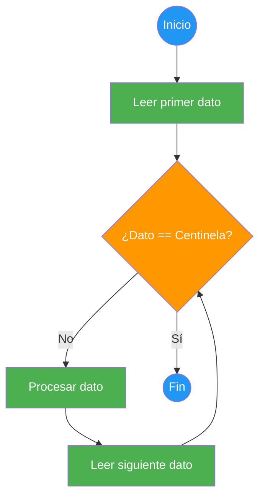

```java
// Sumar números hasta que se introduce 0 (centinela)
int suma = 0;
int num;

System.out.print("Introduce números a sumar, 0 para acabar: ");
num = sc.nextInt();

while (num != 0) {
    suma += num;
    System.out.print("Introduce números a sumar, 0 para acabar: ");
    num = sc.nextInt();
}

System.out.println("Suma total: " + suma);
```

### C. Bucles anidados

Los bucles se pueden **anidar** (un bucle dentro de otro). Especialmente útil para matrices.

```java
// Generar tabla de multiplicar (1 a 10)
for (int i = 1; i <= 10; i++) {
    for (int j = 1; j <= 10; j++) {
        System.out.printf("%4d", i * j); // %4d: entero alineado en 4 posiciones
    }
    System.out.println();
}
```

> 📝 **Nota:** Los arrays bidimensionales (matrices) y su manipulación con bucles anidados se estudiarán en la UD03.

## 2.6. Sentencias de salto

Las sentencias de salto permiten alterar el flujo normal de un bucle.

### A. `break`

**Sale completamente** del bucle más cercano. Se usa cuando se ha encontrado lo que buscabas.

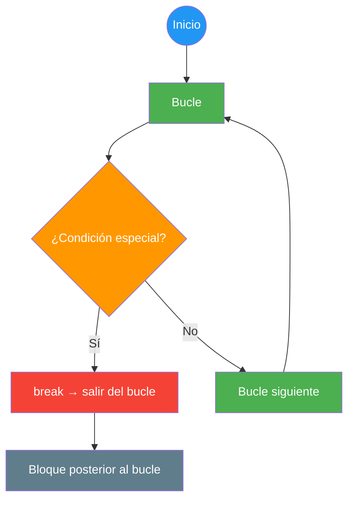

```java
// Buscar un número en un array
int[] numeros = {5, 12, 8, 23, 1, 9};
int objetivo = 23;

for (int i = 0; i < numeros.length; i++) {
    if (numeros[i] == objetivo) {
        System.out.println("Encontrado " + objetivo + " en posición " + i);
        break; // No necesitamos seguir buscando
    }
}
// Salida: Encontrado 23 en posición 3
```

### B. `continue`

**Salta** a la siguiente iteración del bucle, sin ejecutar el código que queda en la iteración actual.

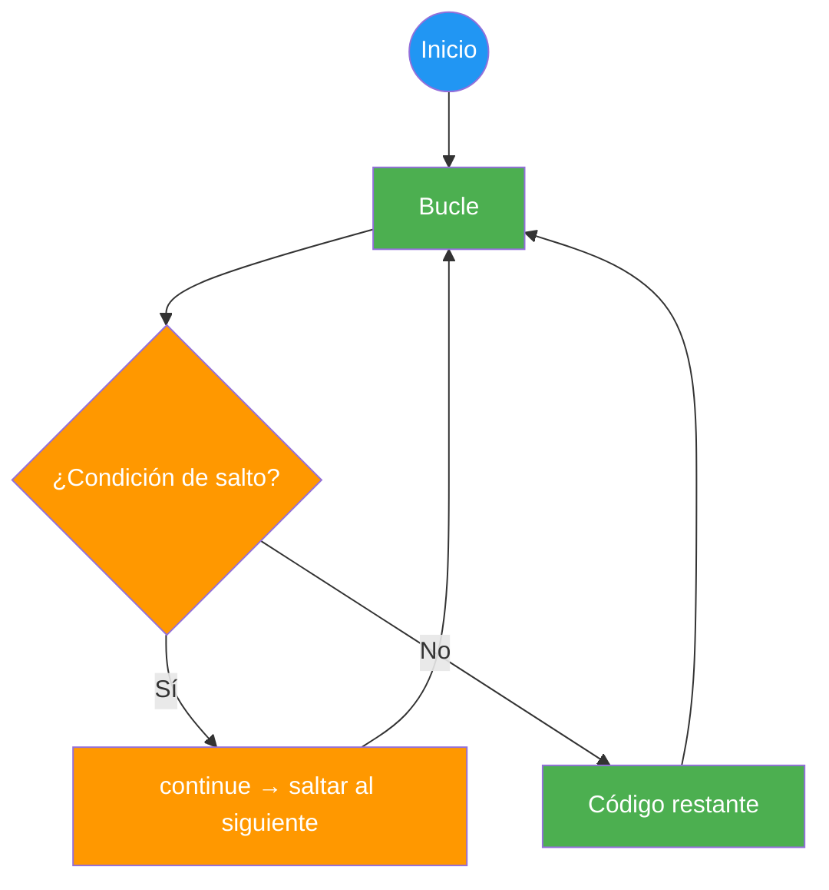

```java
// Mostrar solo números pares
for (int i = 1; i <= 10; i++) {
    if (i % 2 != 0) {
        continue; // Saltar impares
    }
    System.out.println(i + " es par");
}
// Salida: 2 es par, 4 es par, 6 es par, 8 es par, 10 es par
```

> ⚠️ **Advertencia:** Usa `break` y `continue` con moderación. Un uso excesivo dificulta la legibilidad. Si tu bucle necesita muchos `break`/`continue`, probablemente necesite reestructurarse.

## 2.7. Peligros: el bucle infinito

Un bucle infinito ocurre cuando la condición de salida **nunca se vuelve falsa**.

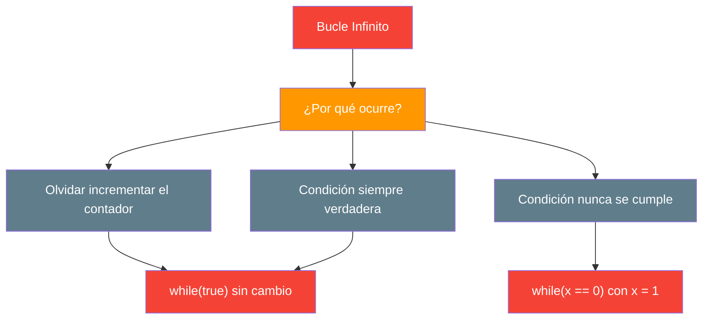

```java
// (Fragmentos independientes)

// ❌ ERROR: Bucle infinito — olvidaste incrementar
int contador = 0;
while (contador < 10) {
    System.out.println(contador);
    // contador NUNCA cambia → bucle infinito
}

// ✅ CORRECTO
int contador = 0;
while (contador < 10) {
    System.out.println(contador);
    contador++;  // ¡Importante!
}

// ❌ ERROR: Condición siempre verdadera
while (true) {  // Nunca sale (no hay break)
    // ...
}

// ❌ ERROR: Condición que nunca se cumple
int opcion = 0;
while (opcion == 5) {  // Si opcion empieza en 0, nunca entra
    // ...
}
```

> 💡 **Consejo:** Antes de ejecutar un bucle, hazte la pregunta: **"¿Cómo sale este bucle?"** Si no tienes respuesta, tienes un bucle infinito.

> 📝 **Tip de depuración:** Si tu programa se queda "colgado", probablemente tienes un bucle infinito. Usa el depurador del IDE para pausar y ver el valor de las variables de control.

## 2.8. Depuración: aserciones y técnicas

La **depuración** es el proceso de encontrar y corregir errores en el código. Existen varias técnicas:

### Depurador del IDE

La forma más efectiva es usar el **depurador** de tu IDE (IntelliJ IDEA o VS Code con el *Extension Pack for Java*):

1. Pon un **punto de interrupción** (breakpoint) en la línea sospechosa (clic en el margen izquierdo)
2. Ejecuta en modo depuración (botón **Debug**, el icono del insecto)
3. Inspecciona el valor de las variables en tiempo real
4. Avanza línea a línea (**Step Over**, `F8` en IntelliJ) o entra en los métodos (**Step Into**, `F7`)

### Impresión de depuración

A veces no tienes depurador o es más rápido un `System.out.println`:

```java
int[] numeros = {5, 12, 8, 23, 1};

for (int i = 0; i < numeros.length; i++) {
    System.err.println("DEBUG: i=" + i + ", numeros[i]=" + numeros[i]); // Depuración
    if (numeros[i] == 23) {
        System.out.println("¡Encontrado!");
        break;
    }
}
```

> 💡 **Truco:** `System.err` es la salida de errores. En IntelliJ aparece en rojo, así distingues fácilmente los mensajes de depuración de la salida normal del programa.

### Depuración con IntelliJ IDEA

```java
// Al depurar, el IDE muestra el valor de las variables junto a cada línea
for (int i = 0; i < 5; i++) {
    int cuadrado = i * i; // ← Al depurar, el IDE muestra i = 0, cuadrado = 0
    System.out.println(i + "² = " + cuadrado);
}
```

> 💡 **Consejo:** Aprende a usar el depurador de tu IDE. Es la herramienta más poderosa que tiene un programador. Más rápida y precisa que cualquier `System.out.println`.

### Aserciones (`assert`)

Una **aserción** es una comprobación que escribes para verificar algo que, según tu lógica, **siempre debería ser cierto**. Si no lo es, hay un error en tu código y el programa se detiene con un `AssertionError`.

```java
static double calcularMedia(int suma, int cantidad) {
    // Supuesto del programador: nunca deberían llamarme con cantidad 0
    assert cantidad > 0 : "La cantidad debe ser positiva y es " + cantidad;
    return (double) suma / cantidad;
}
```

> ⚠️ **Importante:** En Java las aserciones están **desactivadas por defecto**. Para activarlas hay que ejecutar con la opción `-ea` (*enable assertions*):
> - Por consola: `java -ea Main`
> - En IntelliJ: *Run → Edit Configurations → Modify options → Add VM options* y escribe `-ea`

> 💡 **Consejo:** Las aserciones sirven para **detectar errores del programador durante el desarrollo**, no para validar lo que escribe el usuario. Para validar datos de entrada usa `if` o excepciones (punto 4), porque en producción las aserciones normalmente están desactivadas.

📌 **Ejemplo real:** Los desarrolladores de Netflix usan el depurador para encontrar por qué un vídeo se congela: ponen un breakpoint en el bucle de reproducción, inspeccionan la memoria y detectan que el buffer se llenó.

En el siguiente punto veremos la programación modular: métodos (funciones y procedimientos), cómo se pasan los parámetros en Java, records, varargs, recursividad y cómo dividir un problema en partes pequeñas y reutilizables.

## Buenas prácticas

- [ ] Usar solo las tres estructuras de control: secuencia, condicional y bucle
- [ ] Aplicar DRY: si copias y pegas código, necesitas un bucle o un método
- [ ] Evaluar condicionales de mayor a menor rango en `if-else if` encadenados
- [ ] Terminar cada `case` del `switch` clásico con `break` (o usar la sintaxis `->`) para evitar el fall-through
- [ ] Comparar `String` con `equals()`, nunca con `==`
- [ ] Comprobar `!= null` (o usar `instanceof`) antes de usar un objeto que puede ser `null`
- [ ] Verificar siempre que los bucles tienen una condición de salida clara
- [ ] Preferir `if` (prevención) sobre `try-catch` (reacción) cuando el error es predecible
- [ ] Comprobar con `hasNextInt()` antes de leer con `nextInt()` cuando la entrada viene del usuario
- [ ] Usar `assert` para verificar supuestos internos y activarlas con `-ea` durante el desarrollo
