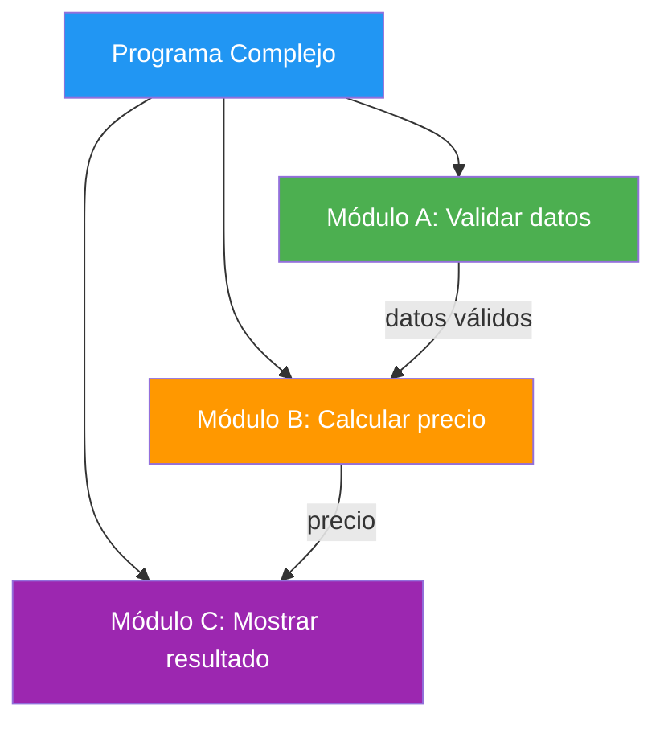
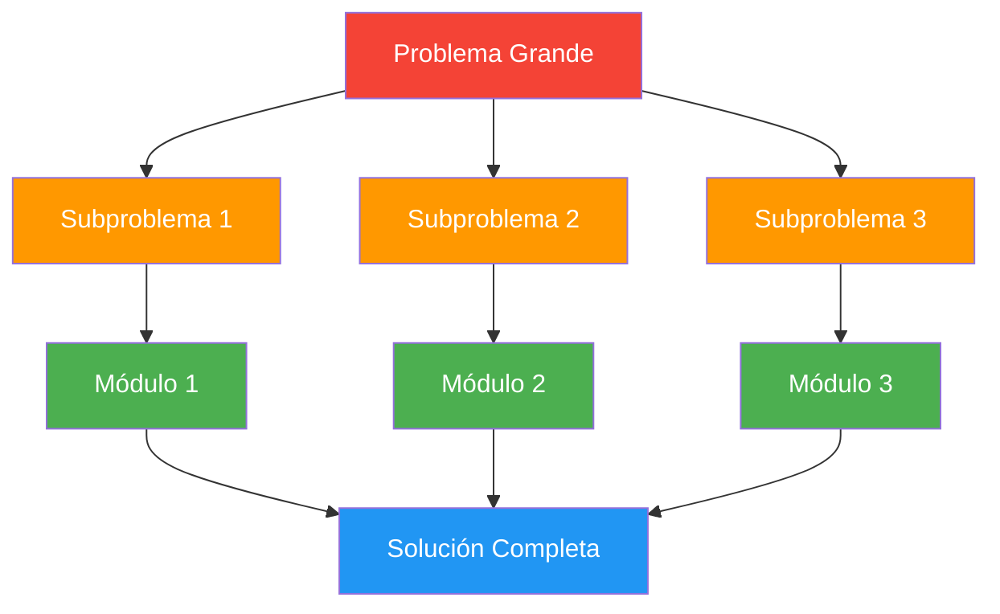
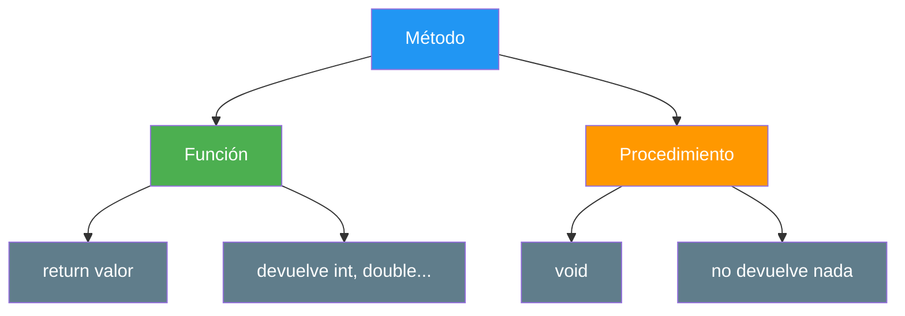
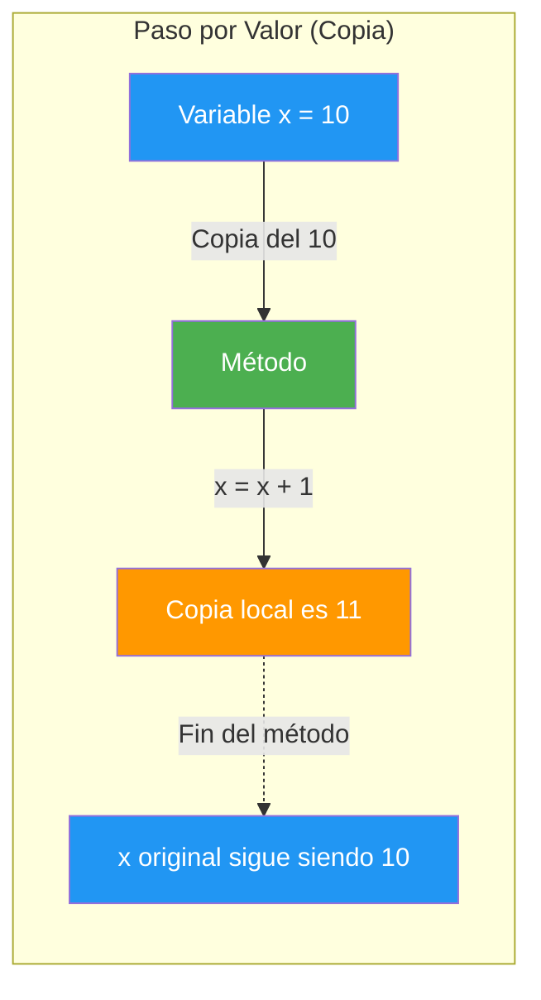
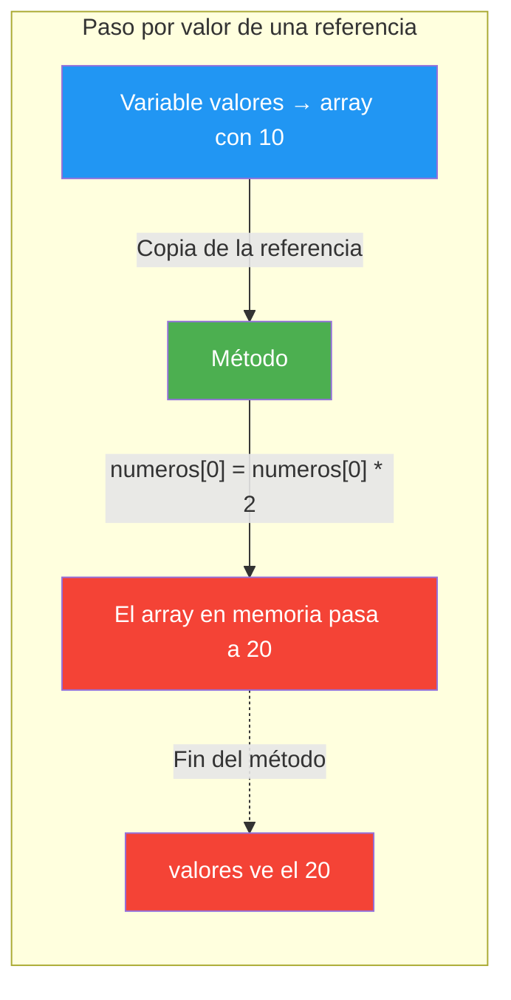
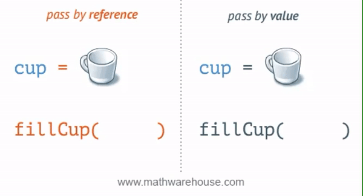
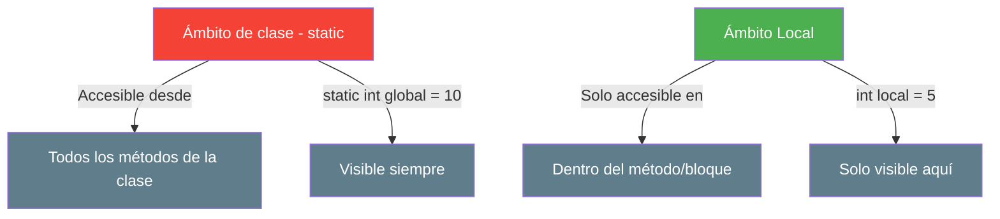
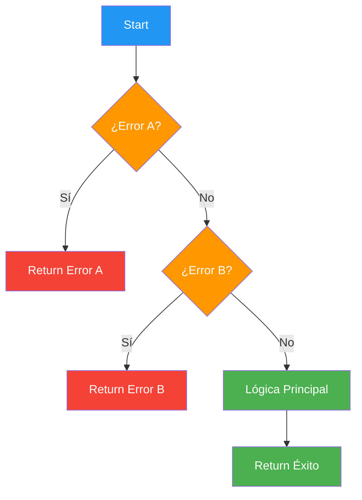
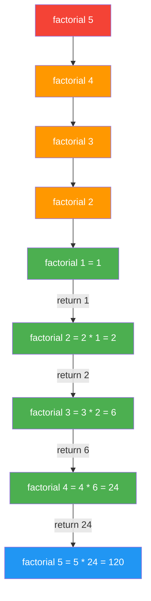
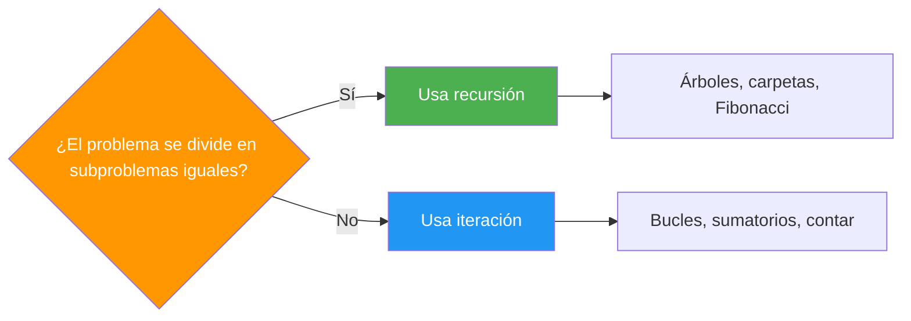

- [3. Programación modular](#3-programación-modular)
  - [3.1. ¿Por qué dividir en módulos?](#31-por-qué-dividir-en-módulos)
  - [3.2. Funciones y procedimientos en Java](#32-funciones-y-procedimientos-en-java)
    - [A. Funciones (devuelven valor)](#a-funciones-devuelven-valor)
    - [B. Procedimientos (no devuelven valor)](#b-procedimientos-no-devuelven-valor)
    - [C. Diferencia entre función y procedimiento](#c-diferencia-entre-función-y-procedimiento)
  - [3.3. Parámetros y argumentos](#33-parámetros-y-argumentos)
    - [A. Paso por valor: el único que existe en Java](#a-paso-por-valor-el-único-que-existe-en-java)
    - [B. Pasar arrays y objetos: se copia la referencia](#b-pasar-arrays-y-objetos-se-copia-la-referencia)
    - [C. Devolver varios valores: records](#c-devolver-varios-valores-records)
    - [D. Parámetros `final` y objetos inmutables](#d-parámetros-final-y-objetos-inmutables)
    - [Records y enums como parámetros y returns](#records-y-enums-como-parámetros-y-returns)
    - [E. Número variable de argumentos (varargs)](#e-número-variable-de-argumentos-varargs)
    - [F. Tabla resumen: cómo pasar y devolver datos en Java](#f-tabla-resumen-cómo-pasar-y-devolver-datos-en-java)
    - [G. Lo que Java no tiene](#g-lo-que-java-no-tiene)
  - [3.4. Ámbito de las variables](#34-ámbito-de-las-variables)
  - [3.5. Parámetros por defecto y nombrados: se simulan con sobrecarga](#35-parámetros-por-defecto-y-nombrados-se-simulan-con-sobrecarga)
  - [3.6. Sobrecarga de métodos](#36-sobrecarga-de-métodos)
  - [3.7. Early Return para simplificar condicionales](#37-early-return-para-simplificar-condicionales)
  - [3.8. Recursividad](#38-recursividad)
  - [3.9. Paquetes e `import`](#39-paquetes-e-import)


# 3. Programación modular

> 💡 **Punto de partida:** ¿Alguna vez has construido algo con LEGO? Cada pieza es pequeña, sencilla y tiene una función clara. Juntas, construyen cualquier cosa. La programación modular es lo mismo: dividir un programa grande en piezas pequeñas, manejables y reutilizables.

**Objetivos de aprendizaje:**

- Comprender qué es la programación modular y por qué es importante
- Diferenciar entre funciones (devuelven valor) y procedimientos (`void`)
- Entender cómo se pasan los parámetros en Java (siempre por valor) y qué ocurre con arrays y objetos
- Devolver varios valores con records y aceptar argumentos variables con varargs
- Entender el ámbito de las variables (local vs. "global")
- Aplicar la recursividad y el Early Return en la resolución de problemas

La **programación modular** consiste en dividir un programa en partes más pequeñas llamadas **módulos**. En Java, estos módulos se implementan como **métodos** (que, según devuelvan o no un valor, llamaremos **funciones** o **procedimientos**).



📌 **Ejemplo real:** Netflix no tiene un solo programa gigante. Tiene módulos separados: uno para el catálogo, otro para la reproducción, otro para las recomendaciones, otro para la facturación. Si cambia el algoritmo de recomendaciones, no toca los demás.

**Ventajas de la modularidad:**

- **Claridad**: cada módulo hace una cosa y la hace bien
- **Reutilización**: un método puede usarse en muchos sitios
- **Mantenimiento**: si hay un bug, solo arreglas un módulo
- **Trabajo en equipo**: cada programador trabaja en módulos diferentes
- **Testing**: puedes probar cada módulo por separado

## 3.1. ¿Por qué dividir en módulos?

La técnica fundamental es **"Divide y Vencerás" (DAC)**:



**Pasos de la descomposición modular:**

1. **Análisis**: Comprender el problema
2. **Identificación**: Dividir en subproblemas
3. **Diseño**: Crear módulos para cada subproblema
4. **Implementación**: Codificar cada módulo
5. **Pruebas**: Probar cada módulo individualmente

**Principio SRP (Single Responsibility Principle):**
Cada módulo debe tener **una única responsabilidad**. Si un método calcula el IVA y también lo imprime, está haciendo dos cosas. Sepáralas.

> 💡 **Consejo:** Si no puedes describir qué hace un método en una frase corta sin usar "y", probablemente está haciendo demasiado. Divídelo.

## 3.2. Funciones y procedimientos en Java

En Java, los módulos se llaman **métodos** y **siempre viven dentro de una clase**. Este es el esqueleto completo de un programa con un método:

```java
public class Main {

    public static void main(String[] args) {
        double area = calcularArea(5.0, 3.0);   // Llamada al método
        System.out.println("Área: " + area);
    }

    // Definición del método, dentro de la clase pero fuera de main
    static double calcularArea(double largo, double ancho) {
        return largo * ancho;
    }
}
```

> 📝 **Nota sobre `static`:** Por ahora todos nuestros métodos llevan `static` porque los llamamos directamente desde `main`, sin crear objetos. En la UD04 (POO) verás los métodos sin `static`. En el resto del punto mostramos solo el método y su uso (que va dentro de `main`).

> 📝 **Convención de nombres:** En Java los métodos se escriben en **lowerCamelCase** y suelen empezar por un verbo: `calcularArea`, `mostrarMensaje`, `esPar`.

Hay dos tipos de métodos:

### A. Funciones (devuelven valor)

Una **función** realiza una tarea y **devuelve un resultado** mediante `return`.

```java
// Función que calcula el área de un rectángulo
static double calcularArea(double largo, double ancho) {
    return largo * ancho;
}

// Uso
double area = calcularArea(5.0, 3.0);
System.out.println("Área: " + area); // Área: 15.0
```


📌 **Ejemplo real:** Spotify tiene una función `calcularDuracionPlaylist()` que recibe una lista de canciones y devuelve la duración total. Esa función se llama cada vez que abres una playlist.

### B. Procedimientos (no devuelven valor)

Un **procedimiento** realiza una tarea pero **no devuelve nada**. Usa `void` como tipo de retorno.

```java
// Procedimiento que muestra un saludo
static void saludar(String nombre) {
    System.out.println("¡Hola, " + nombre + "! Bienvenido.");
}

// Uso
saludar("Ana"); // ¡Hola, Ana! Bienvenido.
```

### C. Diferencia entre función y procedimiento



| Característica | Función | Procedimiento |
|---------------|---------|---------------|
| **Tipo de retorno** | Cualquier tipo (`int`, `double`, `String`...) | `void` |
| **`return`** | Obligatorio (devuelve un valor) | Opcional (sale del método) |
| **Uso típico** | Calcular, obtener, validar | Mostrar, guardar, actualizar |
| **Ejemplo** | `static int sumar(int a, int b)` | `static void mostrarMensaje(String msg)` |

> 📝 **Nota:** En Java ambos se llaman "métodos". La distinción función/procedimiento es conceptual para entender si devuelven o no un valor.

## 3.3. Parámetros y argumentos

Los **parámetros** son las variables de la definición del método. Los **argumentos** son los valores reales que pasas al llamarlo.

```java
// "nombre" y "edad" son PARÁMETROS
static void mostrarInfo(String nombre, int edad) {
    System.out.println(nombre + " tiene " + edad + " años");
}

// "Ana" y 25 son ARGUMENTOS
mostrarInfo("Ana", 25);
```

Ahora veamos **cómo se pasan los datos**. Aquí Java es más sencillo que otros lenguajes, porque tiene **una única regla**:

> ⚠️ **Regla de oro:** En Java **todo se pasa por valor**. El método siempre recibe una **copia**. Lo que cambia es *qué* se copia: con tipos primitivos se copia el dato; con arrays y objetos se copia la **referencia** (la "dirección" del objeto).

### A. Paso por valor: el único que existe en Java

Con los tipos primitivos (`int`, `double`, `boolean`, `char`...), el método recibe una **copia** del dato original. Cualquier modificación **no afecta** a la variable original.



```java
static void incrementar(int numero) {
    numero = numero + 1; // Modifica la COPIA, no el original
    System.out.println("Dentro del método: " + numero); // 11
}

int valorOriginal = 10;
incrementar(valorOriginal);
System.out.println("Fuera del método: " + valorOriginal); // Sigue siendo 10
```

> 💡 **Analogía:** Imagina que le das a un amigo una **fotocopia** de tu examen para que lo revise. Él escribe notas al margen, tacha cosas, añade comentarios... Pero tu examen original **no cambia**. Eso es el paso por valor: el método recibe una copia, puede hacer lo que quiera con ella, pero el original queda intacto.

> 💡 **Analogía 2:** Es como cocinar una receta. Le pasas a tu amigo los ingredientes (harina, huevos, azúcar). Él hace su propio pastel. Tú sigues teniendo tus propios ingredientes intactos. Cada uno trabaja con su propia "copia".

**Ejemplo extra: ¿Y con `String`?**

```java
static void intentarCambiar(String texto) {
    texto = "Modificado";  // La copia local apunta a otro String; el original no cambia
    System.out.println("Dentro: " + texto);  // "Modificado"
}

String original = "Hola";
intentarCambiar(original);
System.out.println("Fuera: " + original);  // Sigue siendo "Hola"
```

> 📝 **Nota:** Los `String` en Java son **inmutables**: ningún método puede cambiar su texto. Por eso un `String` pasado como parámetro se comporta, a efectos prácticos, como un primitivo.

📌 **Ejemplo real:** Piensa en Netflix. Cuando seleccionas una película, la app recibe los datos de la película (título, duración, sinopsis). Si internamente modifica algo temporalmente para mostrarla en una lista diferente, eso **no afecta** a la película original en la base de datos. Trabaja con copias seguras.

### B. Pasar arrays y objetos: se copia la referencia

Otros lenguajes (como C#) tienen un modificador `ref` para que el método trabaje con la variable original. **Java no lo tiene.** Pero cuando pasas un **array** o un **objeto**, lo que se copia es la **referencia**: la "dirección" donde está guardado. Consecuencias:

- ✅ El método **puede modificar el contenido** del array u objeto (y el llamante verá el cambio).
- ❌ El método **no puede hacer que la variable del llamante apunte a otro** array u objeto.



```java
static void duplicar(int[] numeros) {
    numeros[0] = numeros[0] * 2;   // Modifica el CONTENIDO del array original
}

static void reasignar(int[] numeros) {
    numeros = new int[]{999};      // Solo cambia la copia de la referencia
}

int[] valores = {10};

duplicar(valores);
System.out.println("Tras duplicar: " + valores[0]);   // 20 (¡cambió!)

reasignar(valores);
System.out.println("Tras reasignar: " + valores[0]);  // Sigue siendo 20
```

> 💡 **Analogía:** Le das a tu amigo una **copia de la llave de tu casa**. Con ella puede entrar y mover los muebles: cuando vuelvas, verás **tu casa realmente cambiada** (modificar el contenido). Pero si tu amigo cambia *su* copia de la llave por la de otra casa, **tu llave sigue abriendo tu casa** (reasignar no afecta al llamante).



> 📝 **Nota:** La animación muestra la idea de copia frente a referencia. Recuerda que en Java la referencia **también se pasa por valor**: se copia la llave, no se comparte la variable.

**¿Y si necesito que un método "cambie" una variable primitiva del llamante?**

No se puede directamente. La solución limpia es **devolver el nuevo valor**:

```java
static int duplicar(int numero) {
    return numero * 2;
}

int valor = 10;
valor = duplicar(valor);   // Reasignamos con el resultado
System.out.println(valor); // 20
```

**Uso típico: intercambiar dos valores**

```java
// ❌ NO funciona: a y b son copias, el llamante no ve el cambio
static void intercambiarMal(int a, int b) {
    int temporal = a;
    a = b;
    b = temporal;
}

// ✅ Funciona: los valores están dentro de un array (compartido mediante la referencia)
static void intercambiar(int[] v, int i, int j) {
    int temporal = v[i];
    v[i] = v[j];
    v[j] = temporal;
}

int[] nums = {10, 20};
intercambiar(nums, 0, 1);
System.out.println("nums[0]: " + nums[0] + ", nums[1]: " + nums[1]); // nums[0]: 20, nums[1]: 10
```

> 💡 **Analogía del intercambio:** Dos jugadores de baloncesto quieren intercambiarse las camisetas. Si cada uno solo tiene una fotocopia de la camiseta del otro, no ha cambiado nada. Si las camisetas están colgadas en el mismo vestuario (el array) y alguien las cambia de percha, el cambio es REAL para los dos.

> ⚠️ **Cuidado con los efectos secundarios:** Como un método puede modificar el contenido de un array u objeto que le pasas, a veces lo hará sin que te lo esperes. Si no quieres que lo toque, pásale una copia: `valores.clone()` o `Arrays.copyOf(valores, valores.length)`. Y si tu método modifica lo que recibe, **déjalo claro en su nombre y su documentación**.

📌 **Ejemplo real:** En un juego multijugador como Fortnite, cuando un jugador recoge un objeto, un método `recogerObjeto(jugador, objeto)` añade el objeto al inventario del jugador. Como `jugador` es un objeto, el método modifica su contenido y el cambio se ve en todo el juego. (Las clases y objetos los verás a fondo en la UD04.)

### C. Devolver varios valores: records

Un método de Java solo puede devolver **un valor** con `return`. Otros lenguajes tienen parámetros de salida (`out` en C#) o tuplas para devolver varios. **Java no**, pero tiene algo mejor para este caso: los **records** (Java 16+).

Un **record** es un tipo que agrupa varios datos con nombre. Con una sola línea, Java genera automáticamente el constructor, los métodos para leer cada campo, `equals()` y `toString()`:

```java
// Declaración del record (dentro de la clase Main, fuera de main, o en su propio fichero)
record ResultadoDivision(boolean exito, double valor) {}

static ResultadoDivision intentarDividir(int num, int den) {
    if (den == 0) {
        return new ResultadoDivision(false, 0); // Indicamos que ha fallado
    }
    return new ResultadoDivision(true, (double) num / den);
}

// Uso
ResultadoDivision r = intentarDividir(10, 3);
if (r.exito()) {
    System.out.printf("Resultado: %.2f%n", r.valor()); // Resultado: 3,33 (en un equipo en español)
} else {
    System.out.println("No se puede dividir por cero");
}
```

> 💡 **Analogía:** Un record es como pedir una **caja combo** en un restaurante: recibes una caja que contiene plato principal, postre y bebida juntos, y puedes sacar cada cosa por su nombre.

```java
record Alumno(String nombre, int edad, double nota) {}

static Alumno obtenerAlumno() {
    return new Alumno("Ana", 20, 8.5);
}

Alumno alumno = obtenerAlumno();
System.out.println(alumno.nombre() + " tiene " + alumno.edad() + " años y sacó " + alumno.nota());
System.out.println(alumno); // Alumno[nombre=Ana, edad=20, nota=8.5]
```

> 📝 **Nota:** Para leer un campo de un record se usa el nombre del campo **con paréntesis**: `alumno.nombre()`. Los campos de un record **no se pueden modificar** una vez creado (es inmutable).

**Opciones para devolver varios valores en Java:**

| Opción | Ventajas | Inconvenientes | Cuándo usarla |
| :--- | :--- | :--- | :--- |
| **Record** | Campos con nombre y tipos distintos, legible | Hay que declarar el record | ✅ La opción recomendada |
| **Array** | No hay que declarar nada | Todos del mismo tipo y sin nombres (`r[0]`, `r[1]`...) | Varios valores del mismo tipo (mín, máx) |
| **Modificar un objeto recibido** | Sin tipos nuevos | Efecto secundario poco visible | Casi nunca a este nivel |

**¿Y el `TryParse` de otros lenguajes?** En Java no existe. `Integer.parseInt("abc")` lanza una `NumberFormatException` si el texto no es un número. Para leer números de teclado de forma segura usaremos `Scanner.hasNextInt()`, que verás en el punto 4.

#### Extraer los campos de un record (Java 21+)

Con los **patrones de record** puedes comprobar y "desempaquetar" un record en variables de una sola vez:

```java
if (obtenerAlumno() instanceof Alumno(String nombre, int edad, double nota)) {
    System.out.println(nombre + ": " + nota); // Ana: 8.5
}
```

Si solo te interesan algunos campos, desde **Java 22** puedes ignorar el resto con `_`:

```java
if (obtenerAlumno() instanceof Alumno(String nombre, _, double nota)) {
    System.out.println(nombre + ": " + nota);
}
```

#### Igualdad de records

Los records comparan **por valores** con `equals()`. El operador `==`, en cambio, compara si son **el mismo objeto**:

```java
Alumno a1 = new Alumno("Ana", 20, 8.5);
Alumno a2 = new Alumno("Ana", 20, 8.5);

System.out.println(a1 == a2);       // false: son dos objetos distintos en memoria
System.out.println(a1.equals(a2));  // true: tienen los mismos valores
```

> ⚠️ **Advertencia sobre `==` y tipos por referencia**

> Recordarás de la UD01 que hay tipos primitivos (guardan el valor) y tipos por referencia (guardan la dirección del objeto). Esto afecta directamente al operador `==`:

> ```java
> // ✅ Primitivos: == compara el VALOR
> int a = 5, b = 5;
> System.out.println(a == b);  // true
>
> // ❌ Arrays: == compara REFERENCIAS, no contenido
> int[] x = {1, 2, 3};
> int[] y = {1, 2, 3};
> System.out.println(x == y);               // ¡false! Son arrays distintos
> System.out.println(Arrays.equals(x, y));  // true (import java.util.Arrays)
>
> // ❌ Strings: == también compara referencias
> String s1 = "Hola";
> String s2 = "Hola";
> String s3 = new String("Hola");
> System.out.println(s1 == s2);       // true... por casualidad (Java reutiliza los literales)
> System.out.println(s1 == s3);       // ¡false!
> System.out.println(s1.equals(s3));  // true
> ```

> 📝 **Regla:** En Java, `==` solo para primitivos (y `enum`). Para `String`, records y objetos usa **`equals()`**. Para arrays usa **`Arrays.equals()`**.

### D. Parámetros `final` y objetos inmutables

Si marcas un parámetro como `final`, el método **no puede reasignarlo**. Es una forma de dejar claro que ese parámetro solo se va a leer:

```java
static void ejemploFinal(final int limite, final int[] datos) {
    // limite = 5;            // ❌ ERROR de compilación: no se puede reasignar un parámetro final
    // datos = new int[5];    // ❌ ERROR de compilación
    datos[0] = 99;            // ✅ Compila: final NO protege el contenido del array
}
```

> ⚠️ **Importante:** `final` impide cambiar la variable, **no el objeto al que apunta**. Si quieres la garantía completa de que nadie lo modifique, usa **objetos inmutables**, como los records:

```java
record Punto(double x, double y) {}

static double calcularDistancia(Punto p1, Punto p2) {
    // No hay forma de modificar p1 ni p2: los campos de un record no se pueden cambiar
    return Math.sqrt(
        Math.pow(p2.x() - p1.x(), 2) +
        Math.pow(p2.y() - p1.y(), 2)
    );
}

System.out.println(calcularDistancia(new Punto(0, 0), new Punto(3, 4))); // 5.0
```

> 💡 **Analogía:** Un record es como un cuadro en un **museo**. Puedes mirarlo, sacar fotos, leer la descripción... pero **no puedes tocarlo**. Si lo intentas, el guardia de seguridad (el compilador) te dice: "NO TOCAR".

### Records y enums como parámetros y returns

Ya conoces los enums de la UD01, y acabas de ver los records. Ambos se usan como **tipo de parámetro** y **tipo de retorno** igual que cualquier otro tipo.

#### Records como parámetros y return

```java
record Pelicula(String titulo, int anio) {}

// Record como parámetro
static void mostrarPelicula(Pelicula p) {
    System.out.println(p.titulo() + " (" + p.anio() + ")");
}

// Record como return
static Pelicula obtenerPelicula() {
    return new Pelicula("Inception", 2010);
}

// Uso
mostrarPelicula(obtenerPelicula()); // Inception (2010)
```

#### Enums como parámetros y return

```java
enum DiaSemana { LUNES, MARTES, MIERCOLES, JUEVES, VIERNES, SABADO, DOMINGO }

// Enum como parámetro
static boolean esFinDeSemana(DiaSemana dia) {
    return dia == DiaSemana.SABADO || dia == DiaSemana.DOMINGO; // Con enums, == es correcto
}

// Enum como return
static DiaSemana obtenerDiaActual() {
    return DiaSemana.MIERCOLES;
}

// Uso
DiaSemana hoy = obtenerDiaActual();
if (esFinDeSemana(hoy))
    System.out.println("¡Es fin de semana!");
else
    System.out.println("A trabajar");
```

> 📝 **Convención:** Los valores de un `enum` se escriben en MAYÚSCULAS, como las constantes.

#### Ejemplo combinado: crear y mostrar un alumno

```java
record Estudiante(int id, String nombre, double nota) {}

static void mostrarEstudiante(Estudiante e) {
    System.out.println(e.nombre() + " (ID: " + e.id() + "): " + e.nota());
}

static Estudiante crearEstudiante(String nombre, double nota) {
    return new Estudiante(1, nombre, nota);
}

// Uso
Estudiante ana = crearEstudiante("Ana", 8.5);
mostrarEstudiante(ana);  // Ana (ID: 1): 8.5
```

> 💡 **Nota:** Pasar un record a un método no lo copia (se copia solo la referencia), así que es eficiente aunque tenga muchos campos. Y como es inmutable, el método no puede estropearlo.

### E. Número variable de argumentos (varargs)

Los **varargs** permiten pasar un **número indeterminado de argumentos** del mismo tipo. Se escriben con tres puntos (`tipo...`) y el método los recibe como un array.

> 💡 **Analogía:** Los varargs son como una **lista de la compra**. No sabes cuántos productos vas a poner: puede ser 1, 5 o 20. El método acepta todos los que le pases.

```java
static int sumarTodos(int... numeros) {
    int suma = 0;
    for (int numero : numeros) {
        suma += numero;
    }
    return suma;
}

// Puedes pasar los argumentos separados por comas
System.out.println(sumarTodos(1, 2, 3));         // 6
System.out.println(sumarTodos(10, 20, 30, 40));  // 100
System.out.println(sumarTodos(5));               // 5
System.out.println(sumarTodos());                // 0 (ningún argumento: array vacío)
```


```java
// Ejemplo extra: calcular el promedio de notas
static double promedio(double... notas) {
    double suma = 0;
    for (double nota : notas) {
        suma += nota;
    }
    return suma / notas.length;
}

System.out.println(promedio(7.5, 8.0, 9.5));   // 8.333333333333334
System.out.println(promedio(10, 9, 8, 7, 6));  // 8.0
System.out.println(promedio(5.5));             // 5.5
```

📌 **Ejemplo real:** Ya has usado varargs sin saberlo: `System.out.printf("%s tiene %d años%n", nombre, edad)` acepta cualquier número de valores después del formato. Una función `log(String... mensajes)` podría recibir 1, 5 o 20 mensajes sin cambiar nunca su definición.

> ⚠️ **Regla:** Los varargs deben ser el **último** parámetro de la lista y solo puede haber uno por método. Es como la lista de la compra: va al final y solo tienes una.

### F. Tabla resumen: cómo pasar y devolver datos en Java

| Necesidad | Cómo se hace en Java | Analogía |
|-----------|----------------------|----------|
| Pasar un dato para que el método lo use | Paso por valor (siempre) | Fotocopia de un documento |
| Que el método modifique datos del llamante | Pasar un array u objeto y modificar su **contenido** | Copia de la llave de tu casa |
| Cambiar una variable primitiva del llamante | No se puede: devolver el nuevo valor con `return` | — |
| Devolver varios valores | Devolver un **record** | Caja combo |
| Garantizar que no se modifica | Parámetros `final` + objetos inmutables (records) | Museo: mirar pero no tocar |
| Número variable de argumentos | Varargs (`tipo...`) | Lista de la compra |

### G. Lo que Java no tiene

Si en el futuro programas en otros lenguajes (por ejemplo, C# en Unity), te encontrarás mecanismos que Java no tiene. Es bueno saber que existen y cómo se resuelven en Java:

| En otros lenguajes | ¿Qué hace? | En Java |
|--------------------|------------|---------|
| `ref` | Pasar la variable original | Devolver el valor, o usar un array/objeto |
| `out` | Parámetros de salida | Devolver un record |
| `in` / `ref readonly` | Referencia de solo lectura | Objetos inmutables (records) |
| Parámetros por defecto | `void f(int x = 5)` | Sobrecarga (punto 3.5) |
| Argumentos nombrados | `f(edad: 18)` | No existen (el IDE muestra los nombres como pista) |
| Métodos de extensión (`this`) | Añadir métodos a una clase ajena | Métodos `static` auxiliares |

> 💡 **Consejo:** Por ahora, domina el paso por valor (y qué pasa con arrays y objetos), los records para devolver varios valores y los varargs. Con eso cubres todos los casos.

## 3.4. Ámbito de las variables

El **ámbito** (scope) determina **dónde puede ser accedida** una variable.



Java no tiene variables globales "de verdad": lo más parecido es un **atributo `static`** declarado en la clase, fuera de los métodos.

```java
public class Main {

    static int valorGlobal = 100; // Atributo static: accesible desde todos los métodos de la clase

    public static void main(String[] args) {
        mostrarValor(); // OK: muestra ambos
        // System.out.println(valorLocal); // ❌ ERROR: valorLocal no existe aquí
    }

    static void mostrarValor() {
        int valorLocal = 50; // Ámbito local: solo existe dentro de este método
        System.out.println("Global: " + valorGlobal + ", Local: " + valorLocal);
    }
}
```

El ámbito local también se aplica a los **bloques**: una variable declarada dentro de un `for`, un `if` o unas llaves `{ }` solo existe dentro de ese bloque.

```java
for (int i = 0; i < 3; i++) {
    int doble = i * 2;
}
// System.out.println(i);     // ❌ ERROR: i solo existe dentro del for
// System.out.println(doble); // ❌ ERROR: doble tampoco
```

> ⚠️ **Advertencia:** Evita los atributos `static` usados como "variables globales". Crean dependencias ocultas y efectos secundarios difíciles de rastrear. Usa parámetros para pasar datos.

## 3.5. Parámetros por defecto y nombrados: se simulan con sobrecarga

En otros lenguajes puedes escribir `void mostrarInfo(String nombre, int edad = 18)` para que un parámetro tenga un valor por defecto. **Java no permite parámetros por defecto ni argumentos nombrados.** La forma habitual de conseguir el mismo efecto es la **sobrecarga encadenada** (la sobrecarga la verás en detalle en el punto 3.6):

```java
// Versión completa: es la única que hace el trabajo
static void mostrarInfo(String nombre, int edad, String ciudad) {
    System.out.println(nombre + ", " + edad + " años, " + ciudad);
}

// Versiones "cortas": rellenan los valores por defecto y llaman a la completa
static void mostrarInfo(String nombre, int edad) {
    mostrarInfo(nombre, edad, "Desconocida");
}

static void mostrarInfo(String nombre) {
    mostrarInfo(nombre, 18);
}

// Uso
mostrarInfo("Ana", 25, "Madrid");  // Ana, 25 años, Madrid
mostrarInfo("Luis", 30);           // Luis, 30 años, Desconocida
mostrarInfo("Juan");               // Juan, 18 años, Desconocida
```

> 💡 **Consejo:** Escribe la lógica **una sola vez** en la versión completa y haz que las demás la llamen. Así aplicas DRY: si cambia la forma de mostrar la información, solo tocas un método.

> 📝 **Nota:** Como no hay argumentos nombrados, en llamadas con muchos parámetros es fácil confundir el orden. IntelliJ muestra el nombre de cada parámetro como pista junto a los argumentos. Cuando un método necesite muchos parámetros opcionales, más adelante verás el patrón *Builder* (POO).

## 3.6. Sobrecarga de métodos

Permite definir múltiples métodos con el **mismo nombre** pero **diferente lista de parámetros** (distinto número o tipo).

```java
static int calcularArea(int lado) {
    return lado * lado;
}

static double calcularArea(double radio) {
    return Math.PI * radio * radio;
}

static int calcularArea(int largo, int ancho) {
    return largo * ancho;
}

// Java elige la versión correcta según los argumentos
System.out.println(calcularArea(5));       // 25 (int)
System.out.println(calcularArea(3.5));     // 38.48451000647496 (double)
System.out.println(calcularArea(4, 6));    // 24 (dos enteros)
```

> ⚠️ **Advertencia:** El tipo de retorno **no basta** para sobrecargar. Dos métodos `int calcular(int x)` y `double calcular(int x)` dan error de compilación, porque Java no sabría cuál llamar.

## 3.7. Early Return para simplificar condicionales

Consiste en usar `return` para salir inmediatamente cuando se detecta un error o caso trivial, evitando el "efecto cascada" de `if` anidados. También se conoce como **Guard Clauses** (Cláusulas de Guarda).



**¿Por qué funciona?** Las Guard Clauses al inicio del método eliminan los casos de error rápidamente. Una vez superadas, sabemos que los datos son válidos y podemos escribir la lógica principal **sin anidar**.

```java
// ❌ MALO: Efecto cascada (Hadouken)
static double calcularDescuento(double precio, int cantidad, boolean esVip) {
    if (precio > 0) {
        if (cantidad > 0) {
            if (esVip) {
                return precio * cantidad * 0.8;
            } else {
                return precio * cantidad * 0.9;
            }
        } else {
            return 0;
        }
    } else {
        return 0;
    }
}

// ✅ BUENO: Early Return (Guard Clauses)
static double calcularDescuento(double precio, int cantidad, boolean esVip) {
    // Guard Clauses: eliminar casos de error rápidamente
    if (precio <= 0) return 0;
    if (cantidad <= 0) return 0;

    // Lógica principal: limpia y plana
    double factor = esVip ? 0.8 : 0.9;
    return precio * cantidad * factor;
}
```

> 💡 **Consejo:** Si tu método tiene más de 2 niveles de anidamiento (`if` dentro de `if`), es candidato a Early Return. La lógica principal debe quedar al nivel más bajo posible.

## 3.8. Recursividad

La recursividad es cuando un método **se llama a sí mismo**. Requiere siempre una **condición de parada** (caso base).

```java
static int factorial(int n) {
    if (n <= 1) return 1;          // Caso base: ¡parada!
    return n * factorial(n - 1);   // Llamada recursiva
}

System.out.println(factorial(5)); // 120 (5 * 4 * 3 * 2 * 1)
```



📌 **Ejemplo real:** Instagram genera miniaturas de tus fotos recursivamente: cada vez que subes una foto, crea una versión más pequeña, y de esa versión crea otra aún más pequeña, hasta llegar al tamaño mínimo.

> ⚠️ **Peligro: `StackOverflowError`**
> Si olvidas la condición de parada, el método se llama infinitamente hasta agotar la pila de llamadas y la JVM lanza un `StackOverflowError`.

```java
// ❌ ERROR: Sin condición de parada → StackOverflowError
static void infinito() {
    infinito(); // Nunca para
}

// ✅ CORRECTO: Con condición de parada
static void cuentaAtras(int n) {
    if (n <= 0) return;  // ¡Parada!
    System.out.println(n);
    cuentaAtras(n - 1);
}
```

| Aspecto | Iterativo (`for/while`) | Recursivo |
|---------|------------------------|-----------|
| **Memoria** | Constante O(1) | Crece O(n) en pila |
| **Velocidad** | Rápido | Lento (llamadas) |
| **Legibilidad** | Puede ser compleja | Elegante para ciertos problemas |
| **Debugging** | Fácil | Más difícil |

### Factorial: recursivo vs iterativo

Veamos el mismo problema resuelto de las dos formas para comparar:

```java
// RECURSIVO: se parece a la definición matemática
static int factorialRecursivo(int n) {
    if (n <= 1) return 1;
    return n * factorialRecursivo(n - 1);
}

// ITERATIVO: usa un bucle
static int factorialIterativo(int n) {
    int resultado = 1;
    for (int i = 2; i <= n; i++)
        resultado *= i;
    return resultado;
}

// Ambos dan lo mismo
System.out.println(factorialRecursivo(5)); // 120
System.out.println(factorialIterativo(5)); // 120
```

| | Recursivo | Iterativo |
|---|---|---|
| **Legibilidad** | ✅ Elegante, se parece a la fórmula matemática | ⚠️ Más verboso |
| **Rendimiento** | ❌ Más lento (crea una llamada en la pila por cada paso) | ✅ Más rápido (solo una variable) |
| **Memoria** | ❌ O(n) en pila de llamadas | ✅ O(1) constante |
| **Debugging** | ❌ Más difícil de seguir | ✅ Más fácil con el depurador |

> 📝 **Nota:** Con `int`, el factorial se desborda a partir de 13! (el resultado no cabe y Java da un número incorrecto **sin avisar**). Para valores mayores usa `long` (hasta 20!) o `BigInteger`.

📌 **¿Cuándo usar cada uno?**
- **Recursión**: cuando el problema se divide naturalmente en subproblemas iguales (árboles, carpetas, torres de Hanoi)
- **Iteración**: cuando sabes el número de pasos o necesitas rendimiento



> 💡 **Regla nemotécnica:** "Todo lo que se puede resolver con recursividad se puede resolver con bucles (a veces con más esfuerzo). Usa recursividad cuando el problema tenga estructura jerárquica (árboles, factoriales, torres de Hanoi)."

## 3.9. Paquetes e `import`

Los **paquetes** (`package`) agrupan clases relacionadas para organizar el código y evitar conflictos de nombres. Equivalen a carpetas: el paquete `miproyecto.modelos` corresponde a la carpeta `miproyecto/modelos`.

```java
// Fichero: src/miproyecto/modelos/Persona.java
package miproyecto.modelos;

public class Persona {
    // ...
}
```

```java
// Fichero: src/miproyecto/Main.java
package miproyecto;

import miproyecto.modelos.Persona; // Importamos la clase de otro paquete

public class Main {
    public static void main(String[] args) {
        Persona p = new Persona();
    }
}
```

> 📝 **Nota:** Los nombres de paquete se escriben en minúsculas. Las clases del paquete `java.lang` (`String`, `Math`, `System`, `Integer`...) se importan automáticamente; otras, como `Scanner` o `Arrays`, necesitan su `import` (`import java.util.Scanner;`).

`import static` permite usar miembros `static` de una clase sin escribir el nombre de la clase delante:

```java
import static java.lang.Math.sqrt;
import static java.lang.Math.pow;
import static java.lang.System.out;

// Ahora puedes usarlos directamente
out.println("Raíz cuadrada de 16: " + sqrt(16)); // 4.0
double resultado = pow(2, 3); // 8.0
```

> 💡 **Consejo:** Usa `import static` con moderación: si abusas, cuesta saber de qué clase viene cada método.

En el siguiente punto veremos el control de excepciones: `try-catch-finally`, `throw`, `throws`, el burbujeo de excepciones, la diferencia entre excepciones checked y unchecked, y cómo prevenir errores antes de que ocurran.

## Buenas prácticas

- [ ] Aplicar SRP: cada método debe tener una única responsabilidad
- [ ] Recordar que en Java todo se pasa por valor: para obtener un resultado, devuélvelo con `return`
- [ ] Devolver un record cuando un método tenga que devolver varios valores
- [ ] Tener cuidado al modificar arrays u objetos recibidos como parámetro (efectos secundarios)
- [ ] Usar varargs (`tipo...`) solo como último parámetro de la lista
- [ ] Simular parámetros por defecto con sobrecarga encadenada, escribiendo la lógica una sola vez
- [ ] Aplicar Early Return para evitar el "efecto cascada" de `if` anidados
- [ ] Incluir siempre una condición de parada en la recursividad
- [ ] Evitar atributos `static` como "variables globales" — usar parámetros para pasar datos
- [ ] Comparar `String`, records y objetos con `equals()`, y arrays con `Arrays.equals()`
