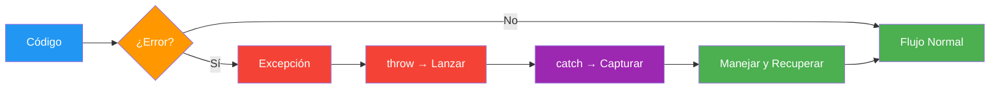
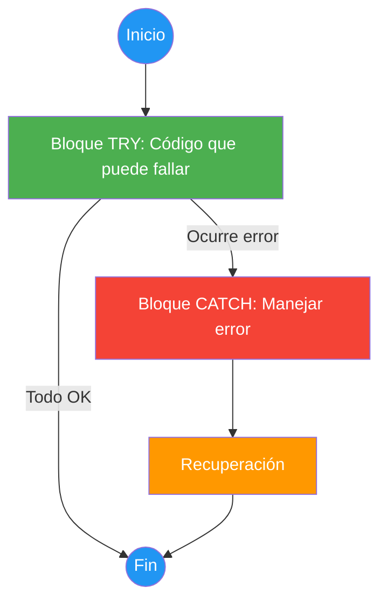
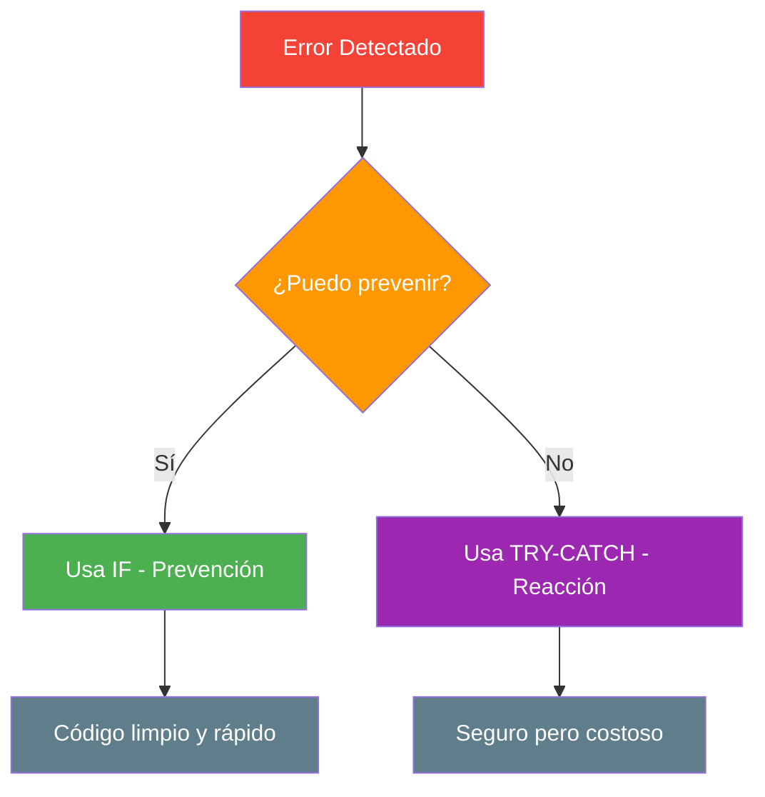
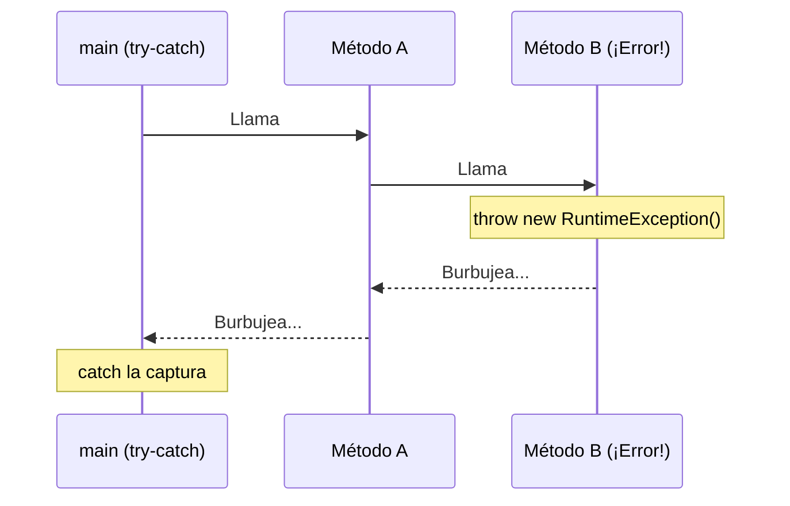
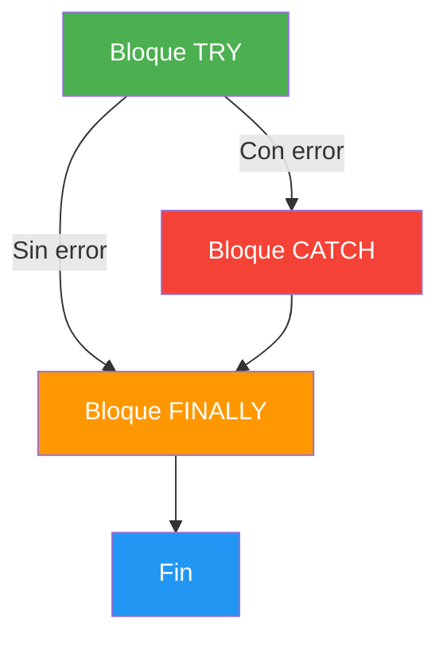
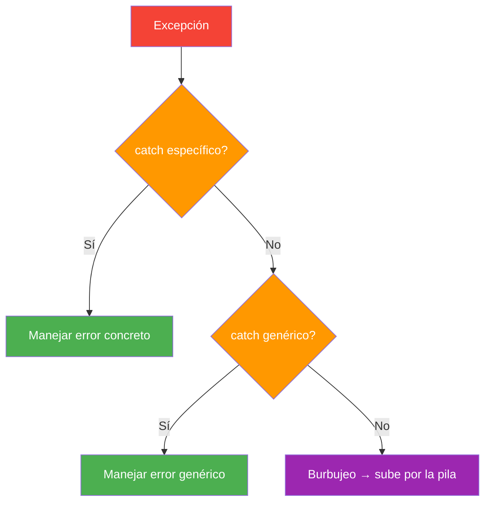
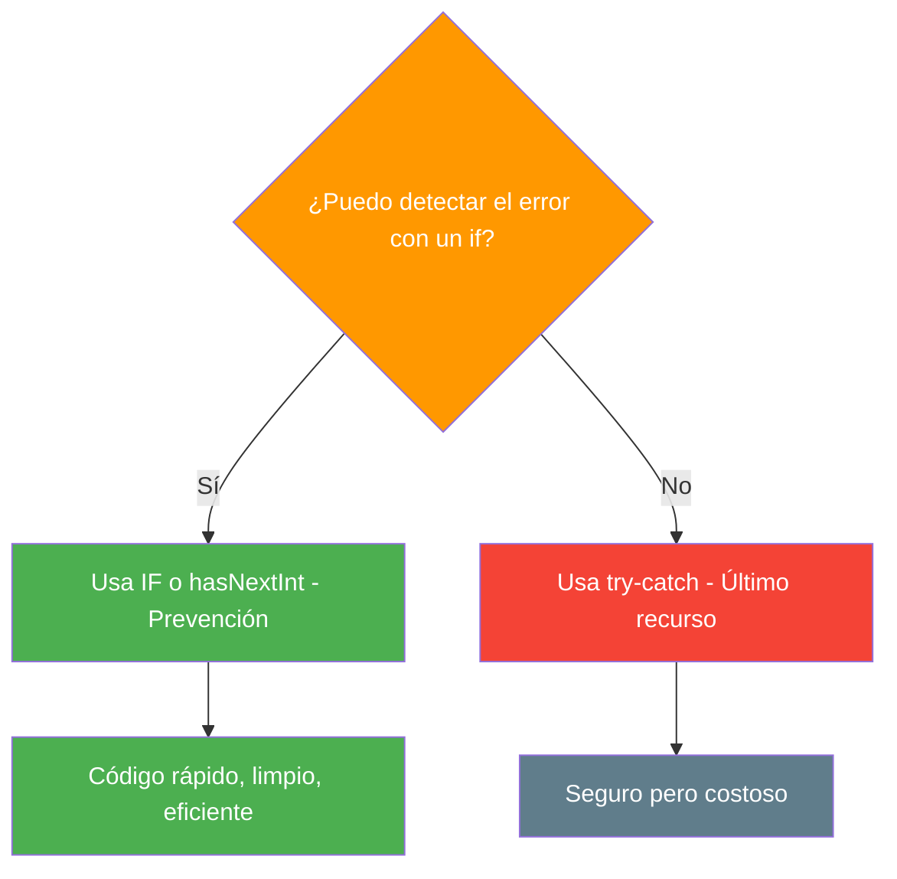
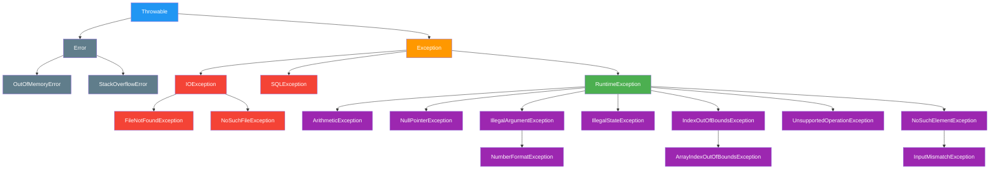

- [4. Control de excepciones](#4-control-de-excepciones)
  - [4.1. ¿Qué es realmente una excepción?](#41-qué-es-realmente-una-excepción)
  - [4.2. Lanzar una excepción (`throw`)](#42-lanzar-una-excepción-throw)
  - [4.3. Capturar una excepción (`try-catch`)](#43-capturar-una-excepción-try-catch)
  - [4.4. El significado profundo de manejar el error](#44-el-significado-profundo-de-manejar-el-error)
  - [4.5. El peligro de tratar las excepciones a la ligera](#45-el-peligro-de-tratar-las-excepciones-a-la-ligera)
  - [4.6. El burbujeo de excepciones](#46-el-burbujeo-de-excepciones)
  - [4.7. Bloques `try`, `catch` y `finally` (y try-with-resources)](#47-bloques-try-catch-y-finally-y-try-with-resources)
  - [4.8. Captura específica y multi-catch](#48-captura-específica-y-multi-catch)
  - [4.9. La diferencia: compilación vs. ejecución](#49-la-diferencia-compilación-vs-ejecución)
  - [4.10. Buenas prácticas y ejemplo práctico](#410-buenas-prácticas-y-ejemplo-práctico)
  - [4.11. Principales excepciones de Java](#411-principales-excepciones-de-java)
  - [4.12. Checked vs unchecked: Java sí obliga a capturar (algunas)](#412-checked-vs-unchecked-java-sí-obliga-a-capturar-algunas)
  - [4.13. Árbol de excepciones de Java](#413-árbol-de-excepciones-de-java)


# 4. Control de excepciones

> 💡 **Punto de partida:** ¿Alguna vez has visto un avión con una bengala roja? Eso es una excepción: algo sale mal, el piloto lanza la bengala, y el control aéreo (el bloque `catch`) actúa en consecuencia. Sin la bengala, el avión seguiría volando con un problema oculto... hasta el desastre.

**Objetivos de aprendizaje:**

- Comprender qué es una excepción y cuándo se produce
- Usar `throw` para lanzar excepciones de negocio y `throws` para declararlas
- Implementar `try-catch-finally` y try-with-resources para manejar errores
- Preferir la prevención (`if`) sobre la reacción (`try-catch`)
- Conocer las principales excepciones de Java, la diferencia checked/unchecked y el árbol de herencia

El **control de excepciones** es una técnica para manejar errores durante la ejecución de un programa. En lugar de que el programa se "cuelgue" o "rompa", las excepciones permiten **capturar y gestionar** los errores de forma controlada.



## 4.1. ¿Qué es realmente una excepción?

Una **excepción** es un evento que interrumpe el flujo normal del programa. Es un "algo excepcional" que ocurre en tiempo de ejecución.

📌 **Ejemplo real:** Si Instagram intenta subir una foto y no hay conexión, se lanza una `IOException` (por ejemplo, una `ConnectException`). El bloque `catch` muestra "No hay conexión" en vez de que la app se cierre.

| Tipo de error | Ejemplo | ¿Se puede prever? |
|--------------|---------|-------------------|
| `NumberFormatException` | `Integer.parseInt("abc")` | Sí → validar antes (`hasNextInt()`) |
| `ArithmeticException` | `10 / 0` (con enteros) | Sí → usar `if` |
| `FileNotFoundException` | Abrir un archivo que no existe | Parcialmente |
| `NullPointerException` | Usar un `null` como si tuviera valor | Sí → verificar nulidad |
| `ArrayIndexOutOfBoundsException` | `array[10]` en un array de 5 | Sí → comprobar el índice |

## 4.2. Lanzar una excepción (`throw`)

`throw` es el acto de **notificar** que algo ha ido mal. Es como disparar la bengala.

```java
static void retirarDinero(double cantidad, double saldo) {
    if (cantidad > saldo) {
        throw new IllegalStateException("Saldo insuficiente.");
    }
    System.out.println("Retirado: " + cantidad + "€. Saldo restante: " + (saldo - cantidad) + "€");
}
```

> 📝 **Nota:** Usamos `double` para simplificar. En aplicaciones reales que manejan dinero se usa `BigDecimal`, porque `double` tiene errores de redondeo (`0.1 + 0.2` no da exactamente `0.3`).

📌 **Ejemplo real:** Si intentas comprar en Amazon y tu tarjeta no tiene fondos, el sistema lanza una excepción de negocio. No es un error técnico, es una regla de negocio que se ha violado.

> 💡 **Consejo:** Lanza excepciones cuando los datos o el estado del programa **no cumplan las reglas del negocio**, incluso si técnicamente la operación es posible.

## 4.3. Capturar una excepción (`try-catch`)

Capturar es el acto de **recibir** la bengala y actuar para que el programa no muera.



```java
try {
    System.out.print("Introduce un número: ");
    int numero = Integer.parseInt(sc.nextLine());
    System.out.println("Tu número: " + numero);
} catch (NumberFormatException e) {
    System.out.println("Error: eso no es un número válido.");
}
```

> 📝 **Nota:** En Java el `catch` siempre declara una variable (`e`) con la excepción capturada. Con ella puedes consultar el mensaje (`e.getMessage()`) o imprimir la traza completa (`e.printStackTrace()`).

## 4.4. El significado profundo de manejar el error

Manejar una excepción **NO es solo poner un mensaje**. Es devolver el programa a un **estado estable**.

- Si una transferencia bancaria falla a la mitad, el `catch` debe asegurar que el dinero vuelve a la cuenta de origen
- Si una subida de archivo falla, el `catch` debe limpiar los archivos parciales



## 4.5. El peligro de tratar las excepciones a la ligera

**1. Estado inconsistente (pérdida de datos)**

Si una excepción salta en mitad de un proceso de 5 pasos y el `catch` solo muestra un mensaje pero no deshace los 2 pasos anteriores, tus datos quedan **corruptos**.

**2. Catch vacíos ("El silencio de los inocentes")**

```java
// ❌ NUNCA hagas esto
try {
    procesoCritico();
} catch (Exception e) {
    // Catch vacío: el error desaparece silenciosamente
    // El programa sigue funcionando pero con errores internos ocultos
}
```

Es como tapar la luz de alarma de un avión con cinta adhesiva. El desastre acabará ocurriendo y será mucho más difícil encontrar el origen.

> ⚠️ **Advertencia:** En Java esta tentación es mayor que en otros lenguajes: como el compilador **obliga** a gestionar algunas excepciones (las *checked*, punto 4.12), es habitual ver `catch` vacíos escritos "solo para que compile". Nunca lo hagas: si no puedes hacer nada útil, declara la excepción con `throws` y deja que la gestione quien te llamó.

## 4.6. El burbujeo de excepciones

Si un método lanza una excepción y no tiene `catch`, esta **burbujea** hacia arriba en la pila de llamadas hasta encontrar uno. Si llega a `main` y nadie la captura, el programa termina mostrando la traza del error.



```java
static void metodoA() {
    metodoB(); // Si metodoB lanza, burbujea aquí
}

static void metodoB() {
    throw new RuntimeException("Error en B"); // Burbujea a metodoA
}

// En main
try {
    metodoA(); // El catch de main la captura
} catch (RuntimeException e) {
    System.out.println("Capturado: " + e.getMessage());
}
```

> 📝 **Nota:** Usamos `RuntimeException` porque es *unchecked*: puede burbujear libremente. Si lanzáramos una excepción *checked* (por ejemplo, `new Exception(...)` o `new IOException(...)`), Java nos obligaría a declararla con `throws` en `metodoB` y en `metodoA`. Lo verás en el punto 4.12.

## 4.7. Bloques `try`, `catch` y `finally` (y try-with-resources)

- **`try`**: "Intenta" ejecutar esto
- **`catch`**: "Si falla", haz esto
- **`finally`**: "Hagas lo que hagas", ejecuta esto al final

```java
import java.io.*;

BufferedReader lector = null;
try {
    lector = new BufferedReader(new FileReader("datos.txt"));
    String linea;
    while ((linea = lector.readLine()) != null) {
        System.out.println(linea);
    }
} catch (FileNotFoundException e) {
    System.out.println("Archivo no encontrado.");
} catch (IOException e) {
    System.out.println("Error al leer: " + e.getMessage());
} finally {
    // Se ejecuta SIEMPRE, tanto si hay error como si no
    if (lector != null) {
        try {
            lector.close(); // close() también puede lanzar IOException...
        } catch (IOException e) {
            System.out.println("Error al cerrar el fichero.");
        }
    }
    System.out.println("Recurso liberado.");
}
```



> 💡 **Consejo moderno:** Como ves, cerrar recursos a mano en el `finally` es farragoso. Desde Java 7 existe **try-with-resources**: declaras el recurso entre paréntesis después del `try` y Java lo cierra automáticamente al terminar, haya error o no. Es la forma recomendada:

```java
// Forma moderna y recomendada
try (BufferedReader lector = new BufferedReader(new FileReader("datos.txt"))) {
    String linea;
    while ((linea = lector.readLine()) != null) {
        System.out.println(linea);
    }
} catch (IOException e) {
    System.out.println("Error al leer: " + e.getMessage());
} // El lector se cierra automáticamente aquí
```

> 📝 **Nota:** try-with-resources funciona con cualquier clase que implemente `AutoCloseable` (ficheros, conexiones a base de datos, `Scanner`...). Lo usarás constantemente en la UD08 (ficheros) y la UD09 (bases de datos).

## 4.8. Captura específica y multi-catch

### Orden de los `catch`: de específico a general

Los bloques `catch` se evalúan **de arriba a abajo**. El primero que coincida se ejecuta y el resto se ignoran. Por eso **siempre** debes poner el más específico primero y el genérico (`Exception`) al final.



```java
try {
    System.out.print("Introduce un divisor: ");
    int numero = Integer.parseInt(sc.nextLine());
    int resultado = 100 / numero;
    System.out.println("100 / " + numero + " = " + resultado);
}
// ✅ BUENO: específico primero
catch (NumberFormatException e) {     // 1º: no es un número → el más probable
    System.out.println("Formato incorrecto: " + e.getMessage());
} catch (ArithmeticException e) {     // 2º: división por cero
    System.out.println("No se puede dividir por cero: " + e.getMessage());
} catch (Exception e) {               // 3º: TODO lo demás → comodín final
    System.out.println("Error inesperado: " + e.getMessage());
}
```

```java
// ❌ MALO: el genérico primero → ¡ni siquiera compila!
try {
    int numero = Integer.parseInt(sc.nextLine());
} catch (Exception e) {                  // ¡Esto captura TODO!
    System.out.println("Error: " + e.getMessage());
} catch (NumberFormatException e) {      // ❌ Error de compilación: ya ha sido capturada
    System.out.println("Formato: " + e.getMessage());
}
```

> ⚠️ **Regla obligatoria:** En Java, poner `catch (Exception e)` antes que un catch más específico es un **error de compilación** ("exception NumberFormatException has already been caught"). El compilador no te deja escribir código inalcanzable.

### Capturar varios tipos en un solo `catch` (multi-catch)

Si quieres que un mismo `catch` maneje varios tipos de excepción, usa el operador `|` (OR) (Java 7+):

```java
try {
    int numero = Integer.parseInt(sc.nextLine());
    int resultado = 100 / numero;
    System.out.println(resultado);
} catch (NumberFormatException | ArithmeticException e) {  // Captura ambos tipos
    System.out.println("Error con el número: " + e.getMessage());
}
```

> 📝 **Nota:** Los tipos de un multi-catch no pueden ser padre e hijo entre sí (por ejemplo, `IOException | FileNotFoundException` da error), porque el padre ya incluye al hijo.

### ¿Y los filtros de excepción?

Algunos lenguajes permiten filtrar un `catch` con una condición (`catch (...) when (...)`). **Java no tiene filtros en el `catch`**: se resuelve con un `if` dentro del bloque. Por ejemplo, para distinguir errores de base de datos según su código (lo verás en la UD09 con JDBC):

```java
try {
    conectarABaseDeDatos();
} catch (SQLException e) {
    if (e.getErrorCode() == 1049) {          // MySQL: la base de datos no existe
        System.out.println("La base de datos no existe.");
    } else if (e.getErrorCode() == 1045) {   // MySQL: acceso denegado
        System.out.println("Credenciales incorrectas.");
    } else {
        System.out.println("Error de SQL: " + e.getMessage());
    }
}
```

> 📝 **Nota:** Los códigos de error dependen del gestor de base de datos (estos son de MySQL). Si en el `else` no puedes hacer nada útil, puedes relanzar la excepción con `throw e;` para que la gestione otro nivel.

> 💡 **Consejo:** Piensa en los `catch` como especialistas médicos: un cardiólogo (catch específico) trata mejor un problema de corazón que un médico general (catch genérico).

## 4.9. La diferencia: compilación vs. ejecución

| Fase | Nivel de Control | Ejemplos de Fallo |
|------|-----------------|-------------------|
| **Compilación** | Alto (programador) | Sintaxis, tipos incorrectos, excepción checked sin capturar ni declarar |
| **Ejecución** | Bajo (entorno) | Disco lleno, red cortada, entrada inválida |

Las excepciones ocurren en **tiempo de ejecución**. Los errores de compilación se detectan antes de ejecutar el programa.

> 📝 **Particularidad de Java:** Aunque las excepciones ocurren al ejecutar, el compilador de Java **revisa en tiempo de compilación** que las excepciones *checked* estén capturadas o declaradas con `throws`. Si no lo están, el programa ni siquiera compila (punto 4.12).

## 4.10. Buenas prácticas y ejemplo práctico

### La regla de oro: SIEMPRE previene con `if`

Esto es **lo más importante** de toda la sección de excepciones. Repítelo como un mantra:

> ⚠️ **REGLA DE ORO:** Si puedes detectar un error con un `if` **antes** de que ocurra, **NUNCA** uses `try-catch`. Las excepciones son el **último recurso**, no la primera opción.

**¿Por qué?** Porque una excepción es **muy costosa**:

| Aspecto | `if` (prevención) | `try-catch` (reacción) |
|---------|-------------------|------------------------|
| **Rendimiento** | Nanosegundos | Mucho más lento |
| **Memoria** | Cero bytes extra | Crea un objeto excepción con la traza (stack trace) completa |
| **Código** | Limpio y directo | Verboso y anidado |
| **Filosofía** | "Evito el error" | "Espero a que explote y lo recojo" |

📌 **Analogía:** Usar `try-catch` cuando puedes usar `if` es como poner una ambulancia detrás de cada coche "por si choca". Funciona, pero es absurdo, caro e ineficiente. Mejor pon un semáforo (un `if`).

### Ejemplos: prevención vs excepción

#### 1. División por cero

```java
// ✅ BIEN: Prevención con if
static int dividir(int a, int b) {
    if (b == 0) {
        System.out.println("No se puede dividir por cero");
        return 0;
    }
    return a / b;
}

// ❌ MAL: Excepción
static int dividirMalo(int a, int b) {
    try {
        return a / b;  // ¡BOOM! ArithmeticException
    } catch (ArithmeticException e) {
        System.out.println("No se puede dividir por cero");
        return 0;
    }
}
```

> ⚠️ **Ojo:** La `ArithmeticException` solo se produce con **enteros**. Con `double`, `10.0 / 0` **no lanza excepción**: devuelve `Infinity` (y `0.0 / 0` devuelve `NaN`). Por eso, con decimales, el `if` es imprescindible.

📌 **¿Cuándo usar `try-catch` para división por cero?** Solo si el divisor viene de una fuente que **no controlas** (una base de datos, un fichero, un usuario remoto) y no puedes verificarlo antes.

#### 2. Acceso a un array

```java
// ✅ BIEN: Prevención con if
static int obtenerElemento(int[] array, int indice) {
    if (indice < 0 || indice >= array.length) {
        System.out.println("Índice fuera de rango");
        return -1;
    }
    return array[indice];
}

// ❌ MAL: Excepción
static int obtenerElementoMalo(int[] array, int indice) {
    try {
        return array[indice];  // ¡BOOM! ArrayIndexOutOfBoundsException
    } catch (ArrayIndexOutOfBoundsException e) {
        System.out.println("Índice fuera de rango");
        return -1;
    }
}
```

#### 3. Convertir texto a número

Java **no tiene un `TryParse`** como otros lenguajes: `Integer.parseInt()` siempre lanza `NumberFormatException` si el texto no es válido. Pero cuando leemos de teclado, `Scanner` nos permite **preguntar antes de leer** con `hasNextInt()`:

```java
// ✅ BIEN: preguntar con hasNextInt() antes de leer (prevención)
System.out.print("Edad: ");
if (sc.hasNextInt()) {
    int edad = sc.nextInt();
    System.out.println("Tienes " + edad + " años");
} else {
    System.out.println("No es un número válido");
}
sc.nextLine(); // Limpiar lo que quede en la línea (entrada incorrecta o salto de línea)

// ⚠️ SOLO SI NO HAY ALTERNATIVA: parseInt con try-catch
System.out.print("Edad: ");
String entrada = sc.nextLine();
try {
    int edad = Integer.parseInt(entrada);  // ¡BOOM! NumberFormatException si no es número
    System.out.println("Tienes " + edad + " años");
} catch (NumberFormatException e) {
    System.out.println("No es un número válido");
}
```

> 📝 **Nota:** Si el texto ya está en un `String` (porque viene de un fichero, de un formulario...), Java no ofrece una conversión que no lance excepción. En ese caso, capturar `NumberFormatException` es **aceptable**. También puedes validarlo antes con una expresión regular, `entrada.matches("-?\\d+")`, aunque no detecta números demasiado grandes para un `int`.

#### 4. Abrir un fichero

```java
import java.io.IOException;
import java.nio.file.*;

// ✅ BIEN: Verificar si existe antes
Path ruta = Path.of("datos.txt");
if (Files.exists(ruta)) {
    try {
        String contenido = Files.readString(ruta);
        System.out.println(contenido);
    } catch (IOException e) {
        // Obligatorio en Java: IOException es checked (punto 4.12)
        System.out.println("Error al leer el fichero: " + e.getMessage());
    }
} else {
    System.out.println("El fichero no existe");
}

// ❌ MAL: usar la excepción para detectar algo que podías comprobar
try {
    String contenido = Files.readString(Path.of("datos.txt"));  // ¡BOOM! NoSuchFileException
    System.out.println(contenido);
} catch (NoSuchFileException e) {
    System.out.println("El fichero no existe");
} catch (IOException e) {
    System.out.println("Error al leer: " + e.getMessage());
}
```

> 💡 **Fíjate:** Aunque compruebes antes con `Files.exists`, Java te **obliga** a gestionar la `IOException`, porque la lectura puede fallar por otros motivos que no puedes prever (permisos, disco dañado, otro programa borra el fichero justo entre la comprobación y la lectura). Prevención y excepción **se complementan**.

#### 5. Leer un entero con rango (el caso clásico)

```java
// ✅ BIEN: hasNextInt() + validación de rango
static int leerEntero(Scanner sc, String mensaje, int min, int max) {
    int valor = 0;
    boolean esValido;

    do {
        System.out.printf("%s (%d-%d): ", mensaje, min, max);
        esValido = sc.hasNextInt();

        if (!esValido) {
            System.out.println("❌ No es un número válido.");
        } else {
            valor = sc.nextInt();
            if (valor < min || valor > max) {
                System.out.printf("❌ El valor debe estar entre %d y %d.%n", min, max);
                esValido = false;
            }
        }
        sc.nextLine(); // Limpiar el resto de la línea (incluido el salto de línea)

    } while (!esValido);

    return valor;
}

// ❌ MAL: parseInt con try-catch
static int leerEnteroMalo(Scanner sc, String mensaje, int min, int max) {
    int valor = 0;
    boolean esValido = false;

    do {
        try {
            System.out.printf("%s (%d-%d): ", mensaje, min, max);
            valor = Integer.parseInt(sc.nextLine());

            if (valor < min || valor > max)
                System.out.println("❌ Fuera de rango.");
            else
                esValido = true;
        } catch (NumberFormatException e) {
            System.out.println("❌ No es un número (o es demasiado grande).");
        }

    } while (!esValido);

    return valor;
}
```

📌 **¿Por qué `hasNextInt()` es mejor?** Porque **pregunta antes de leer**: si la entrada no es válida, simplemente devuelve `false`, sin crear ninguna excepción. Además, también devuelve `false` si el número es demasiado grande para un `int`. Con `parseInt` no tienes forma de saber si el texto es válido sin intentar convertirlo y "esperar a que explote".

### Resumen: ¿Cuándo usar cada uno?



| Situación | ¿Qué usar? | Por qué |
|-----------|------------|---------|
| División por cero | `if (b == 0)` | Es predecible |
| Índice fuera de rango | `if (indice < 0 \|\| indice >= array.length)` | Es predecible |
| Número leído de teclado | `sc.hasNextInt()` | Es predecible |
| Número que ya está en un `String` | `try-catch (NumberFormatException)` | Java no tiene `TryParse` |
| Fichero no existe | `Files.exists(...)` + `try-catch (IOException)` | La `IOException` es checked y obligatoria |
| Conexión a BD falla | `try-catch` | No lo controlas |
| Disco lleno | `try-catch` | No lo controlas |
| Usuario escribe basura | `hasNextInt()` / `hasNextDouble()` | Es predecible |

> ⚠️ **La excepción es para errores INESPERADOS**, no para errores que puedes ver venir. Si puedes ver venir el error, previene con `if`.

> 💡 **Regla nemotécnica:** "Si el `if` puede verlo, el `try-catch` no lo toca."

## 4.11. Principales excepciones de Java

Java trae decenas de excepciones listas para usar. No necesitas crear las tuyas (eso lo verás con herencia en la UD04). Por ahora, aprende a **lanzar y capturar** las que ya existen.

📌 **Ejemplo real:** Netflix lanza `NullPointerException` (mediante `Objects.requireNonNull`) cuando le pasas un ID de usuario nulo, `IllegalArgumentException` cuando el email no tiene formato válido, e `IllegalStateException` cuando intentas acceder a contenido que aún no está disponible.

### Excepciones más usadas

| Excepción | Cuándo se lanza | Ejemplo |
|-----------|----------------|---------|
| `IllegalArgumentException` | Argumento no válido en general | `email` no contiene `@`, `edad` es -5 |
| `NullPointerException` | Se usa un `null` (o un argumento es `null` y no debería) | `Objects.requireNonNull(nombre, "...")` |
| `IndexOutOfBoundsException` | Índice fuera de rango | `ArrayIndexOutOfBoundsException`, `StringIndexOutOfBoundsException` |
| `NumberFormatException` | Texto que no se puede convertir a número | `Integer.parseInt("abc")` |
| `InputMismatchException` | El `Scanner` lee un tipo distinto del esperado | `sc.nextInt()` cuando el usuario escribe "hola" |
| `IllegalStateException` | Operación no válida en el estado actual | Conectar sin haber desconectado |
| `ArithmeticException` | Error aritmético con enteros | `10 / 0`, `Math.addExact` con desbordamiento |
| `UnsupportedOperationException` | Operación no soportada o pendiente de implementar | Método provisional (stub) |
| `IOException` *(checked)* | Error de entrada/salida | Leer un fichero, conexión de red |

> 📝 **Nota sobre el desbordamiento:** En Java, si un `int` se sale de rango, **no se lanza ninguna excepción**: el valor "da la vuelta" (`Integer.MAX_VALUE + 1` vale `-2147483648`). Si quieres que se detecte, usa `Math.addExact(a, b)`, `Math.multiplyExact(a, b)`..., que lanzan `ArithmeticException`.

### Lanzar excepciones existentes

```java
import java.util.Objects;

static void registrar(String nombre, String email, int edad) {
    Objects.requireNonNull(nombre, "nombre: no puede ser nulo");
    if (nombre.length() < 2)
        throw new IllegalArgumentException("nombre: debe tener al menos 2 caracteres y tiene " + nombre.length());
    if (email == null || !email.contains("@"))
        throw new IllegalArgumentException("email: no es válido (" + email + ")");
    if (edad < 0 || edad > 150)
        throw new IllegalArgumentException("edad: debe estar entre 0 y 150 y es " + edad);

    System.out.println("Registrado: " + nombre + ", " + email + ", " + edad + " años");
}
```

> 💡 **Consejo:** Escribe mensajes que digan **qué parámetro** falla y **con qué valor**. Cuando el error aparezca en una traza dentro de seis meses, ese mensaje te ahorrará mucho tiempo.

## 4.12. Checked vs unchecked: Java sí obliga a capturar (algunas)

Java es uno de los pocos lenguajes que distingue dos tipos de excepciones:

| Tipo | Significado | Ejemplos | ¿De quién heredan? |
|------|-------------|----------|--------------------|
| **Checked** | El compilador **obliga** a capturarlas (`catch`) o declararlas (`throws`) | `IOException`, `FileNotFoundException`, `SQLException` | De `Exception`, pero **no** de `RuntimeException` |
| **Unchecked** | El compilador **no obliga** a nada | `NullPointerException`, `ArithmeticException`, `IllegalArgumentException`, `NumberFormatException` | De `RuntimeException` (o de `Error`) |

📌 **Ejemplo real:** En Java, si abres un fichero, el compilador te **obliga** a escribir un `try-catch` o un `throws FileNotFoundException`. En otros lenguajes como C# o Kotlin no existen las excepciones checked: si no capturas la excepción, simplemente burbujea.

### Capturar o declarar: las dos opciones

```java
import java.io.*;

// Opción 1: CAPTURAR (catch) → la gestiono yo aquí
static void leerFichero() {
    try {
        FileReader fr = new FileReader("datos.txt"); // ← puede lanzar FileNotFoundException (checked)
        // ... (cierre omitido para simplificar; usa try-with-resources en código real)
    } catch (FileNotFoundException e) {
        System.out.println("No existe el fichero");
    }
}

// Opción 2: DECLARAR (throws) → la responsabilidad pasa a quien me llame
static void leerFicheroDeclarando() throws FileNotFoundException {
    FileReader fr = new FileReader("datos.txt");
}

// ❌ Sin try-catch NI throws → ¡ERROR DE COMPILACIÓN!
// "unreported exception FileNotFoundException; must be caught or declared to be thrown"
static void leerFicheroMal() {
    FileReader fr = new FileReader("datos.txt");
}
```

> 📝 **Nota:** `throw` (sin s) **lanza** una excepción; `throws` (con s) **declara** en la firma del método que puede lanzarla. No los confundas.

### ¿Por qué Java tiene excepciones checked?

**Ventajas:**

1. **Documentación obligatoria**: la firma del método te dice qué puede fallar (`throws IOException`)
2. **El compilador te recuerda** los errores externos que debes tener en cuenta (ficheros, red, base de datos)
3. **Menos olvidos**: no puedes ignorar sin querer un error recuperable

**Inconvenientes:**

1. **Verbosidad**: hay que decorar muchos métodos con `throws`
2. **Tentación del `catch` vacío**: hay quien captura "para que compile" y oculta el error
3. Por eso, lenguajes más modernos (C#, Kotlin) decidieron **no** tener excepciones checked

> 💡 **Analogía:** Java es como un colegio donde el uniforme es obligatorio **en las ceremonias** (excepciones checked: ficheros, BD, red); el resto de días vas como quieras (unchecked). Otros lenguajes, como C#, son un coworking informal: nunca es obligatorio, pero si vas en pijama y te echan, es tu problema.

### ¿Cómo sé si debo capturar algo?

Si **puedes hacer algo útil** con el error (mostrar mensaje, reintentar, registrar) → **captura**.
Si **no puedes hacer nada** (el programa no puede seguir) → **no captures**: si es checked, **decláralo con `throws`** y deja que burbujee.

```java
// ✅ BUENO: capturo porque puedo mostrar un mensaje útil
try {
    int edad = Integer.parseInt(sc.nextLine());
} catch (NumberFormatException e) {
    System.out.println("Por favor, introduce un número válido");
}

// ✅ TAMBIÉN BIEN: no capturo porque aquí no puedo hacer nada útil → declaro throws
// Si falla la conexión a la BD, que lo gestione quien me llamó
static void conectarABaseDeDatos(String url) throws SQLException {
    try (Connection conexion = DriverManager.getConnection(url)) {
        // ... usar la conexión
    } // Si falla → la SQLException burbujea al nivel superior
}

// ❌ MAL: capturo solo para que compile y oculto el error
static void conectarMal(String url) {
    try (Connection conexion = DriverManager.getConnection(url)) {
        // ...
    } catch (SQLException e) {
        // Vacío: el error desaparece y nadie sabrá por qué no funciona nada
    }
}
```

## 4.13. Árbol de excepciones de Java

Todas las excepciones en Java heredan de `Throwable`. Este es el árbol simplificado con las que trabajarás:



> 📝 **Leyenda:** en rojo, excepciones **checked** (obligatorio capturar o declarar); en verde y morado, **unchecked** (`RuntimeException` y sus hijas); en gris, los **errores** graves de la JVM. El árbol está simplificado: por ejemplo, `NoSuchFileException` cuelga de `IOException` a través de otra clase intermedia.

### Las tres ramas principales

| Rama | Qué representa | Tipo | Ejemplos |
|------|----------------|------|----------|
| **`Error`** | Problemas graves de la JVM, normalmente irrecuperables | Unchecked | `OutOfMemoryError`, `StackOverflowError` (recursividad sin caso base) |
| **`Exception`** (salvo `RuntimeException`) | Errores externos que un programa bien hecho debe prever | **Checked** | Ficheros, base de datos, red |
| **`RuntimeException`** | Errores de programación o de datos incorrectos | Unchecked | `null`, índices, división por cero, formato |

> 💡 **Consejo:** Las `RuntimeException` suelen indicar un **error tuyo** que se arregla con un `if` (prevención). Las checked indican un **problema externo** que no controlas y que debes gestionar con `try-catch` o `throws`.

### Regla de captura según la jerarquía

Como `NumberFormatException` **es un tipo de** `IllegalArgumentException`, que **es un tipo de** `RuntimeException`, que **es un tipo de** `Exception`, cualquiera de estos `catch` capturaría una `NumberFormatException`:

```java
catch (NumberFormatException e)       // Captura SOLO NumberFormatException
catch (IllegalArgumentException e)    // Captura IllegalArgumentException Y sus hijas (NumberFormatException...)
catch (RuntimeException e)            // Captura todas las unchecked
catch (Exception e)                   // Captura todo excepto los Error
```

> 💡 **Consejo:** Captura el tipo **más específico** posible. Si capturas `Exception`, estás tapando errores que podrías manejar mejor con un catch concreto. Y **nunca** captures `Throwable` ni `Error`: son problemas de la JVM que tu programa no puede arreglar.

En el siguiente punto haremos un resumen de toda la unidad, consolidando todos los conceptos vistos: programación estructurada, modular y control de excepciones.

## Buenas prácticas

- [ ] Preferir `if` (prevención) sobre `try-catch` (reacción) cuando el error es predecible
- [ ] Usar `hasNextInt()` antes de `nextInt()` al leer números de teclado
- [ ] Ordenar siempre los `catch` de más específico a más genérico
- [ ] Nunca dejar un `catch` vacío — al menos registrar el error
- [ ] Usar try-with-resources (o `finally`) para liberar recursos siempre
- [ ] Lanzar `IllegalArgumentException`, `IllegalStateException` o `Objects.requireNonNull` con mensajes descriptivos
- [ ] Indicar en el mensaje de error qué parámetro falla y con qué valor
- [ ] Capturar o declarar (`throws`) las excepciones checked, nunca silenciarlas
- [ ] No usar `try-catch` para control de flujo — es costoso y poco legible
- [ ] Capturar el tipo de excepción más específico posible
- [ ] No capturar nunca `Throwable` ni `Error`
