- [5. Resumen y conclusiones UD02](#5-resumen-y-conclusiones-ud02)
  - [5.1. Mapa conceptual de la unidad](#51-mapa-conceptual-de-la-unidad)
  - [5.2. Conceptos clave](#52-conceptos-clave)
    - [Programación estructurada](#programación-estructurada)
    - [Programación modular](#programación-modular)
    - [Control de excepciones](#control-de-excepciones)
    - [Documentación y comentarios](#documentación-y-comentarios)
  - [5.3. Herramientas y perfiles](#53-herramientas-y-perfiles)
    - [IDE](#ide)
    - [Comandos CLI](#comandos-cli)
    - [Depuración](#depuración)
  - [5.4. Errores comunes a evitar](#54-errores-comunes-a-evitar)
  - [5.5. Checklist de supervivencia](#55-checklist-de-supervivencia)
  - [5.6. Glosario de términos](#56-glosario-de-términos)
  - [5.7. Ejercicios de repaso](#57-ejercicios-de-repaso)
  - [5.8. ¿Qué viene después?](#58-qué-viene-después)
  - [5.9. Mapa de conexiones entre temas](#59-mapa-de-conexiones-entre-temas)


# 5. Resumen y conclusiones UD02

> 💡 **Punto de partida:** Has pasado de escribir código lineal a construir programas que piensan (condicionales), repiten (bucles), se organizan (módulos) y se recuperan de errores (excepciones). Eso es ser programador/a.

**Objetivos de aprendizaje:**
- Repasar los conceptos fundamentales de la unidad
- Consolidar el vocabulario técnico
- Tener una referencia rápida para el examen

## 5.1. Mapa conceptual de la unidad

```mermaid
graph TD
    UD02[UD02: Estructurada y Modular] --> ES[Estructurada]
    UD02 --> MO[Modular]
    UD02 --> EX[Excepciones]
    ES --> SEC[Secuencia: paso a paso]
    ES --> CON[Condicional: if, switch]
    ES --> BUC[Bucle: while, for, do-while, for-each]
    ES --> SALTO[Salto: break, continue]
    MO --> FUN[Funciones: return valor]
    MO --> PROC[Procedimientos: void]
    MO --> PARAM[Parámetros: paso por valor, varargs]
    MO --> REC2[Records: devolver varios valores]
    MO --> SCOPE[Ámbito: static vs local]
    MO --> REC[Recursividad]
    MO --> EARLY[Early Return]
    EX --> TRY[try-catch-finally y try-with-resources]
    EX --> THROW[throw: lanzar / throws: declarar]
    EX --> ASSERT[Aserciones: assert]
    EX --> EXJAVA[Excepciones Java: IllegalArgumentException, NumberFormatException...]
    EX --> ORDER[Orden: específico → general]
    EX --> CHECKED[Checked vs unchecked]
    ES --> DOC[Documentación: Javadoc]
    style UD02 fill:#2196F3,color:#fff
    style ES fill:#4CAF50,color:#fff
    style MO fill:#FF9800,color:#fff
    style EX fill:#9C27B0,color:#fff
    style SEC fill:#607D8B,color:#fff
    style CON fill:#607D8B,color:#fff
    style BUC fill:#607D8B,color:#fff
    style SALTO fill:#607D8B,color:#fff
    style FUN fill:#607D8B,color:#fff
    style PROC fill:#607D8B,color:#fff
    style PARAM fill:#607D8B,color:#fff
    style REC2 fill:#607D8B,color:#fff
    style SCOPE fill:#607D8B,color:#fff
    style REC fill:#607D8B,color:#fff
    style EARLY fill:#607D8B,color:#fff
    style TRY fill:#607D8B,color:#fff
    style THROW fill:#607D8B,color:#fff
    style ASSERT fill:#607D8B,color:#fff
    style EXJAVA fill:#607D8B,color:#fff
    style ORDER fill:#607D8B,color:#fff
    style CHECKED fill:#607D8B,color:#fff
    style DOC fill:#607D8B,color:#fff
```



## 5.2. Conceptos clave

### Programación estructurada

- **Teorema**: cualquier algoritmo se escribe con secuencia, condicional y bucle
- **DRY**: no repitas código; si lo haces, necesitas un módulo o un bucle
- **`if-else`**: toma decisiones; evalúa de arriba a abajo
- **`switch`**: compara una variable contra múltiples valores concretos; en el clásico, sin `break` hay *fall-through*; con `->` no
- **`while`**: repite mientras se cumpla la condición (puede no ejecutarse)
- **`do-while`**: como `while` pero garantiza al menos una ejecución
- **`for`**: repite un número conocido de veces (inicialización, condición, incremento)
- **for-each** (`for (tipo x : coleccion)`): recorre colecciones automáticamente
- **`break`**: sale del bucle actual
- **`continue`**: salta a la siguiente iteración
- **Bucle infinito**: error cuando la condición de salida nunca se cumple
- **`null`**: comprobar con `!= null` o `instanceof` antes de usar un objeto
- **`equals()`**: los `String` y los objetos se comparan con `equals()`, no con `==`

📌 **Ejemplo real:** Netflix usa `while` para seguir reproduciendo episodios, `if` para decidir si eres premium, y `for` para recorrer tu lista de favoritos.

### Programación modular

- **DAC (Divide y Vencerás)**: divide problemas grandes en subproblemas
- **SRP**: cada módulo, una responsabilidad
- **Método**: en Java los módulos son métodos y viven dentro de una clase
- **Función**: devuelve un valor (`return`)
- **Procedimiento**: no devuelve nada (`void`)
- **`static`**: por ahora, todos nuestros métodos son `static` para llamarlos desde `main`
- **Paso por valor**: el único mecanismo de Java; el método recibe una copia
- **Arrays y objetos**: se copia la referencia; el método puede modificar su contenido, pero no reasignar la variable del llamante
- **`record`**: forma recomendada de devolver varios valores con nombre
- **Varargs** (`tipo...`): número variable de argumentos (siempre el último parámetro)
- **`final` en parámetros**: impide reasignarlos (no protege el contenido de un objeto)
- **Ámbito "global"**: atributo `static` de la clase (evitar)
- **Ámbito local**: solo dentro del método o bloque (recomendado)
- **Sobrecarga**: mismo nombre, diferentes parámetros; también sirve para simular parámetros por defecto
- **Early Return**: simplifica condicionales (Guard Clauses)
- **Recursividad**: método que se llama a sí mismo (requiere caso base)

📌 **Ejemplo real:** Spotify tiene una función `calcularDuracion()` que reutiliza en todas las playlists. Si cambia la lógica, solo toca un sitio.

### Control de excepciones

- **Excepción**: error en tiempo de ejecución
- **`throw`**: lanza una excepción (notifica el error)
- **`throws`**: declara en la firma que un método puede lanzar una excepción
- **`try`**: rodea el código que puede fallar
- **`catch`**: maneja el error cuando ocurre
- **`finally`**: se ejecuta siempre (liberar recursos)
- **try-with-resources**: cierra los recursos automáticamente (forma recomendada)
- **Burbujeo**: si no hay `catch`, la excepción sube por la pila
- **Preferir `if`**: si el error es predecible, previene en vez de reaccionar (`hasNextInt()`, comprobar índices, divisores...)
- **Checked**: el compilador obliga a capturarlas o declararlas (`IOException`, `SQLException`)
- **Unchecked**: heredan de `RuntimeException`; no es obligatorio capturarlas
- **De específico a general**: orden de los `catch` (al revés, error de compilación)
- **`|` en catch**: capturar varios tipos en un solo bloque (multi-catch)
- **`IllegalArgumentException`**: argumento no válido
- **`NullPointerException`**: uso de `null` (o `Objects.requireNonNull`)
- **`NumberFormatException`**: texto que no se puede convertir a número
- **`IllegalStateException`**: operación no válida en el estado actual
- **`assert`**: aserciones para verificar supuestos durante el desarrollo (se activan con `-ea`)

📌 **Ejemplo real:** Amazon lanza una `IllegalStateException` cuando el carrito está vacío y el usuario intenta pagar. El `catch` muestra un mensaje amigable en vez de que la app se cierre.

### Documentación y comentarios

- **Comentarios `//`**: para explicar lógica compleja o decisiones de negocio
- **Javadoc `/** ... */`**: documentación de clases y métodos que el IDE muestra al usarlos y que la herramienta `javadoc` convierte en páginas HTML
- **`@param`**: describe cada parámetro
- **`@return`**: describe qué devuelve el método
- **`@throws`**: describe qué excepciones puede lanzar y cuándo
- **`{@inheritDoc}`**: reutiliza la documentación del método que se sobrescribe (POO, UD04+)

📌 **Ejemplo real:** Netflix documenta su API interna con Javadoc para que cualquier desarrollador nuevo entienda qué hace cada método sin leer el código completo.

```java
/**
 * Calcula el descuento aplicable a una compra.
 *
 * @param total     importe total de la compra en euros
 * @param esPremium si el cliente es premium
 * @return el descuento aplicado en euros
 * @throws IllegalArgumentException si el total es negativo
 */
static double calcularDescuento(double total, boolean esPremium) {
    if (total < 0) {
        throw new IllegalArgumentException("total: no puede ser negativo y es " + total);
    }
    // Si es premium, 10% de descuento; si no, 5%
    return esPremium ? total * 0.10 : total * 0.05;
}
```

| Tipo de comentario | Cuándo usarlo |
|-------------------|---------------|
| `// Explicación` | Lógica compleja, decisiones "por qué" |
| `/** Javadoc */` | Métodos públicos, clases, interfaces |
| `// TODO:` | Pendientes que hay que resolver |
| `// FIXME:` | Error conocido o solución temporal que hay que mejorar |

> 💡 **Truco:** IntelliJ genera la plantilla de Javadoc automáticamente: escribe `/**` encima del método y pulsa Intro. `TODO` y `FIXME` aparecen resaltados y listados en la ventana *TODO*.

> ⚠️ **Advertencia:** No comentes código autoexplicativo (`// suma dos números` en `suma = a + b`). Comenta el **por qué**, no el **qué**.

## 5.3. Herramientas y perfiles

### IDE
- **IntelliJ IDEA** (Community es gratuita): depurador visual, puntos de interrupción, inspección de variables
- **Visual Studio Code**: con el *Extension Pack for Java*, depurador integrado

### Comandos CLI
- **`javac Main.java`**: compila el código fuente y genera `Main.class`
- **`java Main`**: ejecuta el programa compilado
- **`java Main.java`**: compila y ejecuta en un solo paso (programas de un único fichero)
- **`java -ea Main`**: ejecuta con las aserciones activadas
- **`javadoc -d docs Main.java`**: genera la documentación HTML a partir del Javadoc

### Depuración
- **Breakpoints**: pausan la ejecución en una línea
- **Step Over** (`F8` en IntelliJ): ejecuta una línea sin entrar en los métodos
- **Step Into** (`F7`): entra dentro de los métodos para ver su lógica
- **Watches / Evaluate Expression** (`Alt+F8`): monitoriza variables o evalúa expresiones en tiempo real

## 5.4. Errores comunes a evitar

| Error | Por qué está mal | Cómo evitarlo |
|-------|------------------|---------------|
| Bucle infinito | El programa nunca termina | Verificar que la variable de control cambia |
| `catch` vacío | Oculta errores silenciosamente | Siempre hacer algo en el `catch` (al menos un mensaje), o declarar con `throws` |
| Comparar `String` con `==` | Compara referencias, no el texto | Usar `equals()` |
| `switch` clásico sin `break` | *Fall-through*: se ejecutan también los `case` siguientes | Terminar cada `case` con `break` o usar la sintaxis `->` |
| `nextInt()` seguido de `nextLine()` | `nextLine()` lee el salto de línea pendiente y devuelve `""` | Limpiar el búfer con un `sc.nextLine()` extra |
| Esperar que un método cambie un `int` del llamante | En Java todo se pasa por valor | Devolver el nuevo valor con `return` |
| Excepción checked sin capturar ni declarar | Error de compilación | Añadir `try-catch` o `throws` |
| Usar `try-catch` para todo | Rendimiento degradado y código confuso | Preferir `if` cuando el error es predecible |
| Atributos `static` como variables globales | Efectos secundarios difíciles de rastrear | Usar parámetros para pasar datos |

## 5.5. Checklist de supervivencia

Antes de dar por cerrado el tema, asegúrate de poder responder **SÍ** a estas preguntas:

- [ ] ¿Puedo escribir un `if-else if-else` y un `switch` (clásico y con `->`) para resolver un problema?
- [ ] ¿Sé cuándo usar `while`, `for`, `do-while` y for-each?
- [ ] ¿Puedo crear una función que devuelva un valor y un procedimiento que no devuelva nada?
- [ ] ¿Entiendo por qué en Java todo se pasa por valor y qué ocurre cuando paso un array o un objeto?
- [ ] ¿Sé devolver varios valores con un record?
- [ ] ¿Soy capaz de usar varargs (`tipo...`) para aceptar argumentos variables?
- [ ] ¿Comprendo el ámbito de las variables (local vs. atributo `static`)?
- [ ] ¿Comparo los `String` con `equals()`?
- [ ] ¿Puedo usar `try-catch-finally` y try-with-resources para manejar errores?
- [ ] ¿Sé por qué el `if` (o `hasNextInt()`) es mejor que `try-catch` cuando puedo prever el error?
- [ ] ¿Entiendo qué es la recursividad y por qué necesita un caso base?
- [ ] ¿Puedo usar Early Return para simplificar mi código?
- [ ] ¿Sé documentar un método con Javadoc (`@param`, `@return`, `@throws`)?
- [ ] ¿Puedo lanzar `IllegalArgumentException`, `IllegalStateException` y usar `Objects.requireNonNull` con mensajes descriptivos?
- [ ] ¿Entiendo la diferencia entre excepciones checked y unchecked, y cuándo usar `throws`?
- [ ] ¿Sé ordenar los `catch` de específico a general?
- [ ] ¿Sé usar `assert` y activarlo con `-ea` para verificar supuestos durante la depuración?

> 🔧 **Truco:** Crea un programa que pida dos números y los sume dentro de un método. Luego haz que, si el usuario no introduce números, el programa se lo diga en vez de romperse (primero con `hasNextInt()`, después con `try-catch` de `NumberFormatException`). Si funciona y entiendes la diferencia, dominas lo básico de esta unidad.

## 5.6. Glosario de términos

| Término | Definición |
|---------|------------|
| **Programación estructurada** | Paradigma basado en secuencia, condicional y bucle |
| **Programación modular** | Paradigma que divide el programa en módulos independientes |
| **Secuencia** | Ejecución de instrucciones una tras otra |
| **Condicional** | Estructura que toma decisiones según una condición |
| **Bucle** | Estructura que repite código mientras se cumpla una condición |
| **Fall-through** | En un `switch` clásico, ejecución de los `case` siguientes cuando falta el `break` |
| **DRY** | Don't Repeat Yourself: no repitas código |
| **SRP** | Single Responsibility Principle: un módulo, una responsabilidad |
| **DAC** | Divide and Conquer: divide y vencerás |
| **Método** | Módulo de código dentro de una clase (función o procedimiento) |
| **Función** | Método que devuelve un valor mediante `return` |
| **Procedimiento** | Método que no devuelve nada (`void`) |
| **`static`** | Método o atributo que pertenece a la clase y se usa sin crear objetos |
| **Parámetro** | Variable de la definición del método |
| **Argumento** | Valor real que se pasa al llamar al método |
| **Paso por valor** | El método recibe una copia del dato (o de la referencia); único mecanismo en Java |
| **Referencia** | "Dirección" de un array u objeto en memoria |
| **`record`** | Tipo inmutable que agrupa varios datos con nombre (Java 16+) |
| **Varargs** | Parámetro `tipo...` que acepta un número variable de argumentos |
| **Ámbito** | Zona del programa donde una variable es accesible |
| **Sobrecarga** | Múltiples métodos con el mismo nombre pero diferentes parámetros |
| **Early Return** | Técnica para salir anticipadamente de un método |
| **Guard Clauses** | Condiciones de error al inicio de un método |
| **Recursividad** | Método que se llama a sí mismo |
| **Caso base** | Condición de parada en la recursividad |
| **`StackOverflowError`** | Error por desbordamiento de la pila de llamadas |
| **Excepción** | Error en tiempo de ejecución |
| **`throw`** | Sentencia que lanza una excepción |
| **`throws`** | Declaración en la firma de que un método puede lanzar una excepción |
| **`try-catch`** | Estructura para capturar y manejar excepciones |
| **`finally`** | Bloque que se ejecuta siempre, con o sin error |
| **try-with-resources** | `try` que cierra automáticamente los recursos declarados entre paréntesis |
| **Burbujeo** | Propagación de excepciones por la pila de llamadas |
| **Aserción** | Verificación de supuestos durante el desarrollo (`assert`, se activa con `-ea`) |
| **Javadoc** | Sistema de documentación de Java con comentarios `/** ... */` |
| **`IllegalArgumentException`** | Excepción lanzada cuando un argumento no es válido |
| **`NumberFormatException`** | Excepción lanzada cuando un texto no se puede convertir a número |
| **Checked exception** | Excepción que el compilador obliga a capturar o declarar (`IOException`, `SQLException`) |
| **Unchecked exception** | Excepción que el compilador no obliga a capturar (hereda de `RuntimeException`) |

## 5.7. Ejercicios de repaso

1. **Calculadora simple**: Crea una calculadora que pida dos números enteros y una operación (`+`, `-`, `*`, `/`). Usa `switch` para la operación y evita la división por cero con un `if` (como reto, prueba también a capturar la `ArithmeticException` y compara ambas versiones).

2. **Validador de contraseñas**: Crea un método `static boolean esContrasenaValida(String contrasena)` que verifique: mínimo 8 caracteres, al menos un número, al menos una mayúscula. Recorre los caracteres con un for-each sobre `contrasena.toCharArray()` y usa `Character.isDigit()` y `Character.isUpperCase()`.

3. **Tabla de multiplicar**: Crea un procedimiento `static void mostrarTabla(int numero)` que muestre la tabla de multiplicar de ese número. Usa `for`.

4. **Juego de adivinar**: El programa "piensa" un número del 1 al 100 (`new Random().nextInt(1, 101)`). El usuario intenta adivinarlo con pistas "mayor" o "menor". Usa `do-while` para repetir hasta acertar y `hasNextInt()` para no romperse si escribe texto.

5. **Conversor de temperaturas**: Crea métodos `static double centigradosAFahrenheit(double c)` y `static double fahrenheitACentigrados(double f)`. El usuario elige el sentido.

6. **Suma variable**: Crea un método `static int sumarTodos(int... numeros)` y prueba con diferentes cantidades de argumentos (incluido ninguno).

7. **Recursividad**: Implementa un método recursivo que calcule la suma de los dígitos de un número entero.

8. **Estadísticas con record**: Crea un record `Estadisticas(int minimo, int maximo, double media)` y un método `static Estadisticas calcular(int... numeros)` que lance una `IllegalArgumentException` si no recibe ningún número.

## 5.8. ¿Qué viene después?

En la **UD03: Almacenamiento Estático y Cadenas** aprenderás a almacenar conjuntos de datos en arrays unidimensionales y bidimensionales (matrices), y a trabajar con `String` en profundidad. Usarás los bucles `for` y for-each que viste aquí para recorrerlos, y los métodos para operar con ellos.

| Tema de la UD actual | Se usa en la siguiente UD para |
|----------------------|-------------------------------|
| Bucles `for` y for-each | Recorrer arrays y matrices |
| Funciones y procedimientos | Operar con colecciones de datos |
| Paso de referencias (arrays como parámetros) | Modificar arrays dentro de un método |
| Records | Devolver varios resultados (mínimo, máximo, media...) |
| Varargs | Aceptar listas de elementos de longitud variable |
| `equals()` y `Arrays.equals()` | Comparar cadenas y arrays correctamente |
| Condicionales `switch` | Seleccionar elementos según criterios |
| Early Return | Validar índices antes de acceder a arrays |

## 5.9. Mapa de conexiones entre temas


## Buenas prácticas

- [ ] Repasar los conceptos clave antes de empezar la práctica
- [ ] Seguir el patrón Análisis → Diseño → Codificación
- [ ] Usar el resumen como referencia rápida durante el examen
- [ ] Practicar los ejercicios de repaso hasta dominarlos
- [ ] Revisar el checklist de supervivencia antes de la evaluación
